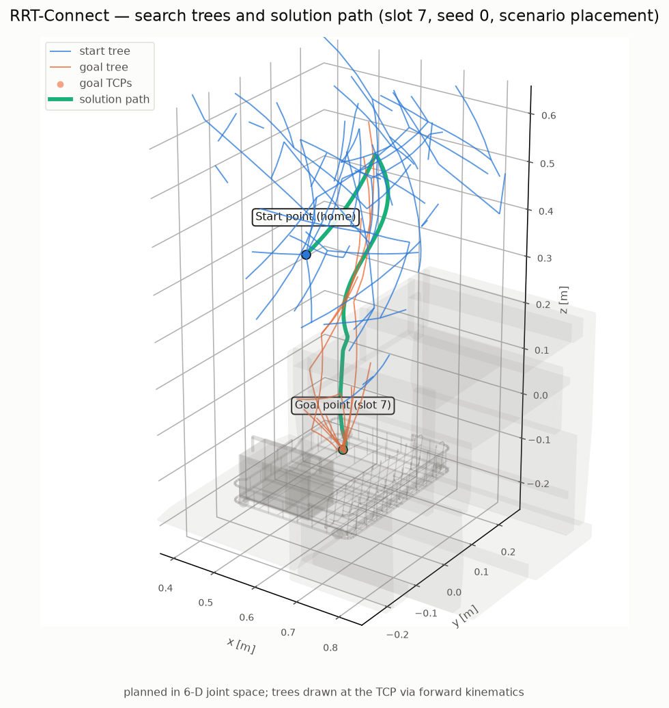
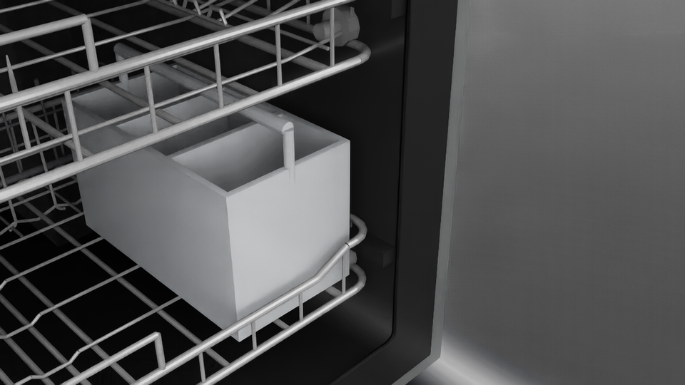
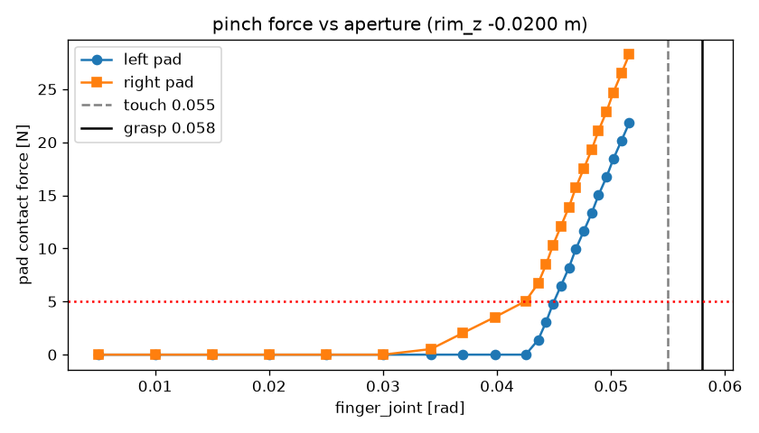

<div align="center">
  <h1 align="center"> dishwasher_sim_isaaclab </h1>
  <h3 align="center"> Isaac Sim environments for robotic dishwasher loading </h3>
  <p align="center">
    Classical motion planning · Imitation learning · Reinforcement learning
  </p>
  <p align="center">
    
    
    
    
  </p>
</div>

<table align="center">
  <tr>
    <td align="center">
      
      <br/>
      <code>scripts/setup/capacity_fill.py</code> — 34 items placed, 31 settle stably, racks still close
    </td>
  </tr>
</table>

## Important Notes First

- **Every Kit script must run through `scripts/run_kit.sh`.** With the planning venv present,
  `isaaclab.sh -p` resolves to the bare venv interpreter, which lacks `EXP_PATH` /
  `LD_LIBRARY_PATH`, and `AppLauncher` dies at boot with `KeyError: 'EXP_PATH'`.
- **`./isaaclab.sh -p` exits 0 even when the wrapped script crashes.** Judge success from log
  content (`[RESULT] PASS`, absence of tracebacks), never from the exit code.
- **Do not up/downgrade Isaac Sim or Isaac Lab.** Everything is pinned to 6.0.1 + 3.0.0; the
  code targets the 3.0 API (XYZW quaternions, `ProxyArray.torch`, keyword-only `*_index`
  writes) and 2.x snippets are wrong on both counts.
- Everything runs `--headless`. Only *rendering* needs `--enable_cameras`; experiments do not.
- First run downloads ~85 MB of ArtVIP assets plus YCB scans, and rebuilding the geometry
  caches costs ~1.5 h — or restore a prebuilt archive in one command (§2.4).
- `assets/`, `media/`, `results/` are gitignored; only curated figures under `docs/figures/`
  are tracked. The asset archive must stay **private** (NVIDIA EULA + YCB dataset terms).
- Developed and tested on a single NVIDIA **L4** (23 GB) / 8 vCPU / 30 GiB. OMPL planning is
  CPU-bound, so core count matters more than the GPU except when rendering.

## 1 Introduction

This project is built on **Isaac Lab** to simulate a **UR5e + Robotiq 2F-85** loading an
articulated **ArtVIP dishwasher**, as a substrate for classical motion planning (shipped),
imitation learning, and reinforcement learning.

The scene: a hinged-door dishwasher whose two sliding racks are replaced with procedurally
generated, reference-styled wire racks plus a 3-bay cutlery basket; a robot on a pedestal; and
a 15-class kitchen-object library scaled to fit the compact machine, each class carrying
*measured* grasp and placement specifications.

Work is organised in three phases, mirrored by the layout of `scripts/`:

| Phase | Folder | Does | Writes |
|---|---|---|---|
| **1 — Setup** | `scripts/setup/` | Prepare assets and build the simulation world: derive USDs, calibrate grasps, extract the collision world, derive goal sets, generate loaded scenes | `assets/`, `docs/` reports |
| **2 — Experiment** | `scripts/experiment/` | Run a robotic algorithm in that world and record what happened | `results/experiments/<run_id>/` |
| **3 — Evaluation** | `scripts/evaluation/` | Compute metrics and render videos **from those artifacts** — never re-planning or re-simulating | `results/evaluation/`, `media/` |

<table align="center">
  <tr>
    <td align="center">
      
      <br/>
      <code>setup/build_object_assets.py</code>
      <br/>
      15-class object library
    </td>
    <td align="center">
      
      <br/>
      <code>setup/preview_rack.py</code>
      <br/>
      Procedural rack + cutlery basket
    </td>
    <td align="center">
      
      <br/>
      <code>setup/goal_configs.py</code>
      <br/>
      Slot derivation from rack geometry
    </td>
  </tr>
  <tr>
    <td align="center">
      
      <br/>
      <code>evaluation/plan_visual.py</code>
      <br/>
      RRT-Connect search trees in workspace
    </td>
    <td align="center">
      
      <br/>
      <code>evaluation/render_videos.py</code>
      <br/>
      Placement rendered <i>from the trajectory file</i>
    </td>
    <td align="center">
      
      <br/>
      <code>setup/calibrate_grasp.py</code>
      <br/>
      Measured pad force vs. aperture
    </td>
  </tr>
</table>

### 1.1 The planner is pluggable

`run_trials.py --planner <name>` selects the algorithm; the experiment runner never names one.
A planner implements one method — `plan(world, start_q, goal_qs, seed, debug)` — and declares
its own capabilities. Adding one touches no experiment code (§5.1).

| Planner | Kind | Multi-goal | Defaults |
|---|---|---|---|
| `rrt_connect` *(default)* | Bidirectional RRT, returns on first connection | ✅ | `range_rad=0.5`, `budget_s=20` |
| `rrt_star` | Asymptotically optimal RRT; always uses the full budget | ✅ | `range_rad=0.5`, `budget_s=10` |
| `bit_star` | Batch Informed Trees; optimizing, batch-sampled | ✅ | `budget_s=10` |
| `prm` | Probabilistic roadmap, rebuilt per query | ❌ | `budget_s=10` |

> **Note:** `prm` declares `supports_multi_goal = False` because the roadmap planners in this
> OMPL build never terminate on a multi-state `ob.GoalStates` — measured at raw-OMPL level with
> a trivial validity checker (1 goal solves in 0.1 s, 2 goals never returns), while `bit_star`,
> `rrt_star` and `KPIECE1` solve the same 2-goal query in under a second. Every real query here
> is multi-goal, so the base class hands `prm` the goal nearest the start instead of hanging.

### 1.2 Evaluation is decoupled from execution

An experiment records the measured scene state every physics step (**~170 KB per trial**,
versus 10–14 MB for one rendered clip); evaluation replays that recording kinematically to
render video afterwards. So experiments run fast and headless, any trial can be re-rendered
later from a different camera or resolution, and metrics never touch a simulator.

The replay is verified, not assumed: `verify_replay.py` reproduces every recorded link pose to
**1e-7 m**, and a rendered clip scores **38 dB PSNR** (median 38.9, p1 31.3) against a live
capture of the same trial with perfect frame alignment.

### 1.3 Object library

Sourced from YCB scans or generated procedurally, then **scaled to fit** — the machine is
compact (lower rack 366 × 287 mm, 154 mm inter-rack clearance, 30 mm tine pitch), so a
full-size dinner plate cannot nest between the tines; the plate here is scaled to 141 mm
across. Each `scale` below documents the factor against its source asset, and
`setup/build_object_assets.py` re-measures the result and refuses to write an asset that
disagrees with the registry.

| Class | Source | Scale | Placement mode | Rack |
|---|---|---|---|---|
| `mug` | Isaac YCB `025_mug` | 1.00 | `floor_stand` | lower |
| `plate` | YCB `029_plate` | 0.54 | `plate_slot` | lower |
| `saucer` | YCB `029_plate` | 0.42 | `plate_slot` | lower |
| `bowl` | YCB `024_bowl` | 0.68 | `bowl_lean` | lower |
| `cup` | YCB `065-a_cups` | 1.10 | `floor_stand` | lower |
| `fork` | YCB `030_fork` | 0.60 | `basket_drop` | basket |
| `spoon` | YCB `031_spoon` | 0.60 | `basket_drop` | basket |
| `knife` | YCB `032_knife` | 0.60 | `basket_drop` | basket |
| `spatula` | YCB `033_spatula` | 0.45 | `flat_lay` | upper |
| `pitcher` | YCB `019_pitcher_base` | 0.50 | `floor_stand` | lower |
| `tumbler` | procedural | 1.00 | `floor_stand` | lower |
| `wine_glass` | procedural | 1.00 | `stem_scallop` | upper |
| `serving_spoon` | procedural | 1.00 | `basket_drop` | basket |
| `container` | procedural | 1.00 | `upside_down` | upper |
| `lid` | procedural | 1.00 | `flat_lay` | upper |

Machine states: `both_out` and `both_in` (the two robot-facing initial states, each with a
rack-reconfiguration action), plus the internal states `placement` and `placement_open` that
trials place in.

### 1.4 Reference documentation

| Doc | Contents |
|---|---|
| [docs/environment.md](docs/environment.md) | Hardware/software stack, venv recipe, Isaac Lab 3.0-vs-2.x API deltas, OMPL 2.0 nanobind notes, launcher landmines |
| [docs/success_criteria.md](docs/success_criteria.md) | Placement success definition per placement mode, slot model, frame conventions |
| [docs/joint_report.md](docs/joint_report.md) | *Auto-generated* by `setup/inspect_scene.py`: measured articulation numbers every constant derives from |
| [docs/grasp_calibration.md](docs/grasp_calibration.md) | *Auto-generated* by `setup/calibrate_grasp.py`: θ_touch/θ_grasp, per-pad force band, mimic signs |
| [docs/asset_survey.md](docs/asset_survey.md) | Survey of the 7 ArtVIP dishwasher variants justifying the `dishwasher_2` pick |

## 2 Environment Setup

### 2.1 Prerequisites

An Isaac Sim 6.0.1 / Isaac Lab 3.0.0 install at `/workspace/isaaclab`. This repo nests inside
that tree as an independent git repo. See the
[official installation guide](https://isaac-sim.github.io/IsaacLab/main/source/setup/installation/index.html),
and [docs/environment.md](docs/environment.md) for this project's pinned versions.

### 2.2 Planning venv

Planning runs on CPU in a venv beside Kit (OMPL, FCL, CoACD are not part of the Kit
environment). Create it at **exactly** this path — `isaaclab.sh` looks for a venv there and
resolves Python to it, which is also why `run_kit.sh` has to re-export the Kit environment.

```bash
/isaac-sim/kit/python/bin/python3 -m venv --system-site-packages /workspace/isaaclab/env_isaaclab
/workspace/isaaclab/env_isaaclab/bin/pip install 'trimesh==4.12.2' ompl python-fcl coacd \
    matplotlib imageio pytest requests pyyaml filelock tqdm fsspec
/workspace/isaaclab/env_isaaclab/bin/pip install -e .
```

### 2.3 Assets

```bash
# dishwasher asset (~85 MB) + derived USDs + the measured joint report
scripts/run_kit.sh -c "from huggingface_hub import snapshot_download; \
  snapshot_download(repo_id='X-Humanoid/ArtVIP', repo_type='dataset', \
  allow_patterns=['Articulated_objects/major_appliances/dishwasher/**'], local_dir='assets/artvip')"
scripts/run_kit.sh scripts/setup/inspect_scene.py --headless --test_door

# object library: the mug from the Isaac asset bucket, the rest from YCB scans + procedural
scripts/run_kit.sh scripts/setup/make_prop_physics_usd.py --object 025_mug
scripts/run_kit.sh scripts/setup/build_object_assets.py
```

### 2.4 Fast path: restore a prebuilt archive

If you have access to the private asset archive (a Hugging Face dataset holding the built
props and every geometry cache), this replaces §2.3 and ~1.5 h of cache rebuilds:

```bash
# authenticate once with a token that can read the private dataset
/workspace/isaaclab/env_isaaclab/bin/python -m huggingface_hub.commands.huggingface_cli \
    login --token hf_xxx
/workspace/isaaclab/env_isaaclab/bin/python scripts/tools/restore_assets.py --with_media
```

> **Note:** the venv installs `huggingface_hub` as a library, not a console script, so
> `huggingface-cli` is not on `PATH` — invoke it as the module above. Pass `--token`
> explicitly; the interactive prompt raises `EOFError` without a TTY.

The restore re-downloads the ArtVIP originals, validates every restored cache's
`config_hash` against the current `config.py`, and runs the test suite.

### 2.5 Verify the install

```bash
scripts/run_kit.sh scripts/setup/kit_smoke.py --headless --enable_cameras
PYTEST_DISABLE_PLUGIN_AUTOLOAD=1 /workspace/isaaclab/env_isaaclab/bin/python -m pytest tests/
```

`kit_smoke.py` proves the planning stack imports *inside* the Kit process and that headless
camera capture produces non-black frames. The suite is **183 test cases across 14 files**, all
Kit-free.

> **Note:** `PYTEST_DISABLE_PLUGIN_AUTOLOAD=1` is required — the system site-packages carry
> hydra, whose pytest plugin imports `yaml`, a module that only exists inside Kit.

## 3 Running

Run from the repo root. Kit scripts go through `scripts/run_kit.sh`; venv scripts use
`/workspace/isaaclab/env_isaaclab/bin/python`, written `$PY` below.

### 3.1 Phase 1 — Setup: build the world

```bash
# collision world for one machine state and carried object
scripts/run_kit.sh scripts/setup/extract_geometry.py --headless --scenario placement
$PY scripts/setup/decompose_meshes.py --scenario placement
scripts/run_kit.sh scripts/setup/parity_check.py --headless --scenario placement

# placement slots + IK goal sets that experiments plan to
scripts/run_kit.sh scripts/setup/goal_configs.py --headless --enable_cameras --object mug

# a fully-loaded machine: 34-item deterministic fill + rack-closability check
scripts/run_kit.sh scripts/setup/capacity_fill.py --headless --enable_cameras
```

- `--scenario`: machine state — `both_out`, `both_in`, `placement`, `placement_open`
- `--object`: carried object class (any key from the table in §1.3)
- `--force` (decompose): re-decompose even when cached pieces exist

> **Note:** `parity_check.py` is the gate that matters — it samples configurations and compares
> the Kit-free FCL world against Isaac's PhysX contacts. It currently agrees **100 %** over 200
> configurations per state. If you change rack geometry or an object, rerun
> `extract_geometry → decompose_meshes → parity_check` before trusting any planning result.

### 3.2 Phase 2 — Experiment: run an algorithm

```bash
# default planner, no cameras — the trajectory is recorded either way
scripts/run_kit.sh scripts/experiment/run_trials.py --headless \
    --scenario both_out --object mug --slots 2,7 --seeds 0-1

# choose and tune the algorithm; also record the search tree for the planning visual
scripts/run_kit.sh scripts/experiment/run_trials.py --headless --planner rrt_star \
    --planner_param range_rad=0.3 --planner_param budget_s=15 \
    --slots 7 --seeds 0 --run_id my_run --save_plan_debug
```

- `--planner`: `rrt_connect` (default) · `rrt_star` · `bit_star` · `prm`
- `--planner_param K=V`: repeatable override, applied on top of `config.PLANNER_PARAMS`.
  Any planner takes `budget_s`, `resolution_rad`, `simplify`; `range_rad` applies to
  `rrt_connect` and `rrt_star`, `goal_bias` to `rrt_star`, `samples_per_batch` to `bit_star`,
  `max_nearest_neighbors` to `prm`
- `--object` / `--scenario`: what to carry, and the initial machine state
- `--slots` / `--seeds`: comma lists or `a-b` ranges; `--repeats` trials per pair
- `--run_id`: names the run (default `<object>_<scenario>_<planner>_<UTC>`)
- `--save_plan_debug`: also write the planning query + search tree for `plan_visual.py`
- `--skip_existing`: resume, skipping trials whose JSON already exists
- `--enable_cameras`: *additionally* capture video inline — only needed for the replay A/B
  check, since Phase 3 renders video from the recording

Each run writes one self-contained directory:

```
results/experiments/<run_id>/
  manifest.json              [run provenance: planner + params, object, scenario, config hash]
  trials/<trial>.json        [outcome, timings, placement error, failure stage]
  trajectories/<trial>.npz   [measured state per physics step — the Phase 3 input]
  plans/<trial>.npz          [the planning query + search tree, with --save_plan_debug]
results/experiments/LATEST   [the newest run id]
```

To compare algorithms, run the same slots and seeds under each and let Phase 3 build the table:

```bash
for p in rrt_connect rrt_star bit_star; do
  scripts/run_kit.sh scripts/experiment/run_trials.py --headless --planner $p \
      --slots 7 --seeds 0 --run_id "cmp_$p"
done
```

> **Note:** a trial's success verdict depends on live contact forces, so it is decided in
> Phase 2 and only *aggregated* in Phase 3. Placement geometry is recomputable from a recorded
> pose, and evaluation cross-checks it against the trial record.

### 3.3 Phase 3 — Evaluation: read the artifacts

None of these re-plan or re-simulate; the first and last need no Kit at all.

```bash
# metrics + figures for the latest run; --all adds the planner-comparison table
$PY scripts/evaluation/compute_metrics.py --all

# prove a recording replays exactly (kinematics only, no cameras, seconds)
scripts/run_kit.sh scripts/evaluation/verify_replay.py --headless \
    --trial results/experiments/<run_id>/trajectories/trial_07_00_0.npz

# render video from recordings — one clip per camera, plus a final still
scripts/run_kit.sh scripts/evaluation/render_videos.py --headless --enable_cameras \
    --run_dir results/experiments/<run_id>/trajectories

# the planner's search tree, drawn from the recorded query
$PY scripts/evaluation/plan_visual.py --slot 7 --seed 0

# A/B a replayed clip against a live capture (the decoupling acceptance test)
$PY scripts/evaluation/compare_videos.py --live <live.mp4> --replay <replay.mp4>
```

| Tool | Reads | Writes | Needs Kit |
|---|---|---|---|
| `compute_metrics.py` | `trials/*.json` + `manifest.json` | `results/evaluation/<run_id>/metrics.json` + figures | no |
| `verify_replay.py` | `trajectories/*.npz` | pass/fail gate on link-pose error | yes (no cameras) |
| `render_videos.py` | `trajectories/*.npz` | `media/trials/<run_id>/*.mp4` + stills | yes + cameras |
| `plan_visual.py` | `plans/*.npz` | search-tree PNGs | no |
| `compare_videos.py` | two MP4s | PSNR verdict + worst-frame sheet | no |

- `compute_metrics.py`: `--run <id>` a specific run · `--all` every run + comparison ·
  `--no_figures`
- `render_videos.py`: `--trial` one file or `--run_dir` a whole run · `--cameras front,iso,top`
  · `--stride N` for a fast preview · `--use_current_cameras` to override recorded poses
- `verify_replay.py`: `--tol_pos_m` (kinematic reconstruction) · `--tol_render_m` (render path)
- `plan_visual.py`: `--run <id>` / `--plan_debug <npz>` to pick the artifact · `--replan` to
  plan a fresh query instead of reading a recorded one

### 3.4 Archive / restore the generated artifacts

```bash
$PY scripts/tools/archive_assets.py --upload      # build tarballs, push to the private dataset
$PY scripts/tools/restore_assets.py --with_media  # download, extract, validate, run tests
```

## 4 Code Structure

```
dishwasher_sim_isaaclab/
│
├── scripts/
│   ├── run_kit.sh                    [Kit launcher: exports the Isaac env, then isaaclab.sh -p]
│   │
│   ├── setup/                        [PHASE 1 — assets and the simulation world]
│   │   ├── kit_smoke.py              [dependency + headless-capture gate]
│   │   ├── inspect_scene.py          [articulation survey -> docs/joint_report.md]
│   │   ├── prepare_dishwasher_usd.py [derived dishwasher USDs (door/rack variants)]
│   │   ├── make_prop_physics_usd.py  [Isaac-bucket prop -> physics USD (the mug)]
│   │   ├── build_object_assets.py    [YCB scans + procedural props -> the object library]
│   │   ├── check_scene.py            [scene verification; --measure derives the pad map]
│   │   ├── calibrate_grasp.py        [per-object pinch calibration (force staircase)]
│   │   ├── freeze_calibration.py     [freeze measured constants into config.OBJECTS]
│   │   ├── extract_geometry.py       [dump the settled scene into the collision cache]
│   │   ├── decompose_meshes.py       [convex FCL pieces (CoACD / analytic parts)]
│   │   ├── parity_check.py           [FCL vs PhysX agreement gate]
│   │   ├── goal_configs.py           [slot frames + IK goal sets]
│   │   ├── preview_rack.py           [rack geometry preview PNGs]
│   │   └── capacity_fill.py          [fully-loaded scene generator + closability check]
│   │
│   ├── experiment/                   [PHASE 2 — run algorithms, write artifacts]
│   │   └── run_trials.py             [rack reconfigure -> pick -> plan -> place -> evaluate]
│   │
│   ├── evaluation/                   [PHASE 3 — reads artifacts only]
│   │   ├── compute_metrics.py        [trial JSONs -> metrics.json + figures + comparison]
│   │   ├── render_videos.py          [trajectory .npz -> MP4s + stills (kinematic replay)]
│   │   ├── verify_replay.py          [replay faithfulness gate, camera-free]
│   │   ├── compare_videos.py         [live-vs-replay PSNR A/B + worst-frame sheet]
│   │   └── plan_visual.py            [planner search tree from the recorded query]
│   │
│   └── tools/
│       ├── archive_assets.py         [tar the generated artifacts, push to a private dataset]
│       └── restore_assets.py         [download, safe-extract, validate caches, run tests]
│
├── src/dishsim/                      [the environment package (installed editable)]
│   ├── config.py                     [EVERY tunable: object registry, grasps, rack params,
│   │                                  planner defaults, cameras, tolerances. Tune here]
│   ├── robots.py                     [UR5e + Robotiq and dishwasher ArticulationCfgs]
│   ├── scene.py                      [scene construction, the wrist weld, gripper control]
│   ├── usd_prep.py                   [derived dishwasher USDs; authors the procedural racks]
│   ├── rack_gen.py                   [procedural wire racks + cutlery basket (Kit-free)]
│   ├── prop_gen.py                   [procedural props: tumbler, wine glass, container, lid]
│   ├── geometry.py                   [USD -> mesh extraction + the collision-cache format]
│   ├── collision_world.py            [Kit-free FCL world; the planners' validity oracle]
│   ├── ur5e_kin.py                   [analytic UR5e FK/IK, 8 branches (Pinocchio-validated)]
│   ├── placement.py                  [slot derivation, goal poses and success per mode]
│   ├── rack_ops.py                   [rack-handle engage + drive-synchronized slide]
│   ├── fill_plan.py                  [deterministic full-load plan + FCL validation]
│   ├── trajectory.py                 [per-step recording format (Phase 2 -> Phase 3)]
│   ├── replay.py                     [kinematic playback of a recording (Phase 3)]
│   ├── plan_debug_io.py              [persist a planning query + search tree]
│   ├── metrics.py                    [Kit-free aggregation over trial records]
│   ├── media.py                      [camera rig, video writer, contact sheets]
│   ├── transforms.py                 [pose helpers (XYZW throughout)]
│   └── planners/                     [the pluggable planner layer]
│       ├── base.py                   [PlanResult, PlanDebug, the Planner ABC]
│       ├── ompl_base.py              [shared OMPL query: space, validity, goals, solve]
│       ├── rrt_connect.py            [bidirectional RRT (default)]
│       ├── rrt_star.py               [asymptotically optimal RRT]
│       ├── bit_star.py               [Batch Informed Trees]
│       ├── prm.py                    [probabilistic roadmap (single-goal here)]
│       └── registry.py               [name -> class; make_planner(); available()]
│
├── tests/                            [183 cases across 14 files; venv pytest, no Kit]
├── docs/                             [environment, success criteria, measured reports]
├── assets/  media/  results/         [generated, gitignored]
└── pyproject.toml
```

## 5 Extending

### 5.1 Add a motion planner

Nothing in `scripts/experiment/` changes. Write a module in `src/dishsim/planners/` — for
anything OMPL provides, subclass `OMPLPlanner` and override the one method that constructs the
algorithm:

```python
# src/dishsim/planners/rrt_connect.py — the worked example
from .. import config
from .ompl_base import OMPLPlanner

class RRTConnectPlanner(OMPLPlanner):
    name = "rrt_connect"

    def _make_planner(self, si):
        from ompl import geometric as og

        planner = og.RRTConnect(si)
        planner.setRange(float(self.params.get("range_rad", config.PLAN_RRT_RANGE_RAD)))
        return planner
```

Then add one line to `PLANNERS` in `registry.py`:

```python
PLANNERS: dict[str, type[Planner]] = {
    RRTConnectPlanner.name: RRTConnectPlanner,
    ...
    MyPlanner.name: MyPlanner,
}
```

`--planner my_planner` now works, and `tests/test_planners.py` covers it automatically — every
registered planner must solve a stub-world query, respect the joint bounds, never return a
colliding path, and describe itself for the trial record.

Parameters are applied **inside** each subclass rather than by a generic loop, because the OMPL
planners do not share a parameter interface (`RRTConnect` has `setRange` only; `RRTstar` adds
`setGoalBias`; `PRM` has neither). A planner that cannot accept a goal set declares
`supports_multi_goal = False` and the base class hands it the goal nearest the start. A
non-OMPL method (lattice A*, CHOMP) implements `Planner` directly — the only thing it needs
from the world is `in_collision(q) -> bool`.

### 5.2 Add an object class

1. Add an `ObjectSpec` to `config.OBJECTS` — source (`ycb16k` / `procedural`), scale, mass,
   a `GraspSpec` (family + contact width) and a `PlacementSpec` (mode + rack).
2. Build the asset: `scripts/run_kit.sh scripts/setup/build_object_assets.py --objects <name>`.
   It prints the *measured* dimensions and fails if they disagree with the registry by >2 mm —
   freeze the printed block into the spec.
3. Measure the pinch: `setup/check_scene.py --measure` for the pad map, then
   `setup/calibrate_grasp.py --object <name>`.
4. Freeze the result: `setup/freeze_calibration.py --object <name>`.
5. Rebuild that object's caches: `extract_geometry` → `decompose_meshes` → `goal_configs`.

> **Note:** never eyeball-edit a measured value. Every dimension, aperture and force band in
> `config.py` traces to a calibration or inspection run, and `geometry.config_hash()`
> invalidates the collision caches when any of them changes.

### 5.3 Add a placement mode

In `src/dishsim/placement.py`: write a `derive_<mode>_slots()` returning `SlotFrame`s, add a
branch to `object_pose_for_mode()` for the goal-pose geometry, and a branch to
`evaluate_placement()` for the success criteria. Register the mode name in the object's
`PlacementSpec`, and document the criteria in `docs/success_criteria.md`.

### 5.4 Add a machine state

Add an entry to `config.INTERNAL_STATES` (rack extensions + `min_feasible_slots`), then rebuild
the cache for it: `extract_geometry --scenario <name>` → `decompose_meshes --scenario <name>`
→ `parity_check --scenario <name>` → `goal_configs --scenario <name>`.


## Acknowledgement

This project builds on the following open-source projects and datasets. Please visit the URLs
for their respective licenses:

1. https://github.com/isaac-sim/IsaacLab — simulation framework (the 3.0 API this targets)
2. https://github.com/isaac-sim/IsaacSim — simulator, PhysX ground truth, and the
   pre-assembled UR5e + Robotiq 2F-85 from the Omniverse asset library (NVIDIA Omniverse
   asset EULA; fetched at spawn, derived copies stay local)
3. https://huggingface.co/datasets/X-Humanoid/ArtVIP — the articulated `dishwasher_2` asset
   (Apache-2.0)
4. https://www.ycbbenchmarks.com — YCB Object & Model Set, Calli et al., *"The YCB Object and
   Model Set"* (IEEE ICAR 2015): textured `google_16k` scans for plate, bowl, cups, cutlery,
   spatula and pitcher, used under the YCB dataset terms
5. https://github.com/ompl/ompl — Șucan, Moll, Kavraki, *"The Open Motion Planning Library"*
   (IEEE RAM 2012): the RRT-Connect, RRT*, BIT* and PRM implementations behind
   `dishsim.planners`
6. https://github.com/BerkeleyAutomation/python-fcl — Pan, Chitta, Manocha, *"FCL: A general
   purpose library for collision and proximity queries"* (ICRA 2012): the Kit-free collision
   world
7. https://github.com/SarahWeiii/CoACD — Wei et al., *"Approximate Convex Decomposition for 3D
   Meshes with Collision-Aware Concavity and Tree Search"* (SIGGRAPH 2022)
8. https://github.com/mikedh/trimesh — mesh processing throughout the asset and collision
   pipelines
9. https://github.com/stack-of-tasks/pinocchio — Carpentier et al.: independent validation of
   the analytic UR5e kinematics in the test suite

Rack geometry is procedurally generated, styled after publicly documented Whirlpool, Bosch and
Frigidaire rack designs (design reference only; no third-party geometry is redistributed).

Downloaded and derived assets are never committed (`assets/`, `media/`, `results/` are
gitignored); the asset archive must remain private, as it contains NVIDIA-EULA- and
YCB-derived files.
