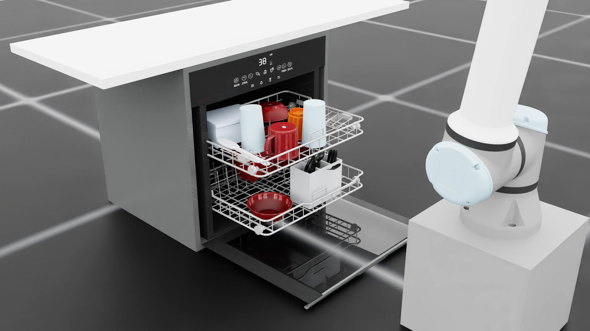
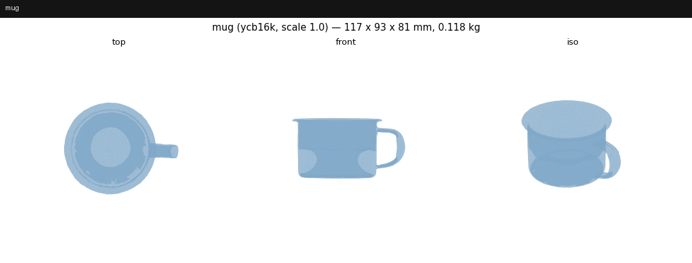
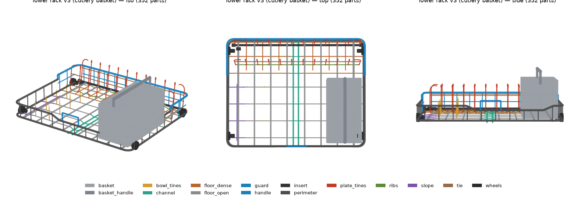
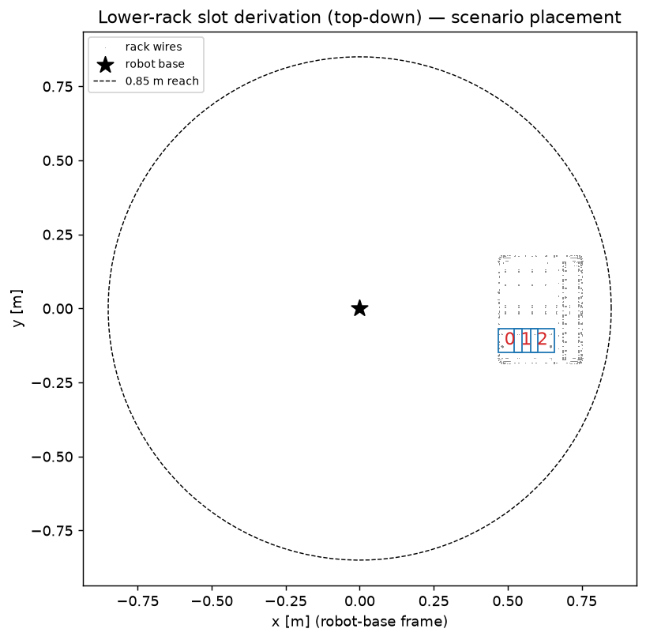
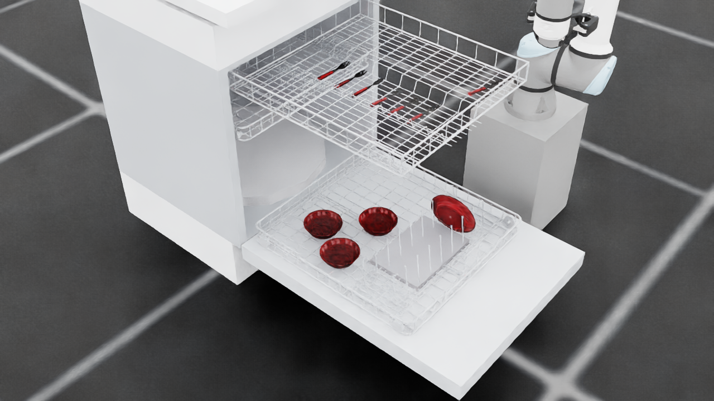

<div align="center">
  <h1 align="center"> dishwasher_sim_isaaclab </h1>
  <h3 align="center"> Arrangement planning for dishwasher loading, physics-validated in Isaac Sim </h3>
  <p align="center">
    Collision-free placement · Physical settle validation · Rearrangement planning substrate
  </p>
  <p align="center">
    
    
    
    
  </p>
</div>

<table align="center">
  <tr>
    <td align="center">
      
      <br/>
      <code>scripts/setup/capacity_fill.py</code> — 29 items placed, 27 settle stably, racks still close
    </td>
  </tr>
</table>

> **Read this first.** Every Kit script runs through `scripts/run_kit.sh` (never bare
> `isaaclab.sh -p` — it dies at boot with the planning venv present), success is judged from
> **log content**, never exit codes (`isaaclab.sh -p` exits 0 on crashes), and the Isaac
> Sim 6.0.1-rc.7 / Isaac Lab 3.0.0 pins must not be changed. The full list of launcher
> landmines and why they exist: [docs/environment.md](docs/environment.md).

## 1 Overview

This project solves the dishwasher **arrangement planning problem**: given a 14-class
kitchen-object library and an articulated dishwasher (the ArtVIP baseline with procedural
wire racks, or a self-authored **Bosch 800 digital twin** with a third rack), decide **where
each object goes**. A placement is feasible when it is

- **collision-free** — a Kit-free FCL world (`dishsim.collision_world`) answers "would this
  object, teleported to this pose, interpenetrate the machine or an already-placed object?"
  in milliseconds, in any plain Python process; and
- **physically stable** — Isaac Sim settles the planned arrangement and judges it against
  per-mode measured tolerances (drift, tilt, seating height, rack closability).

Object motion is **teleportation**: a runner writes root poses and lets physics settle. There
is no robot arm and no motion planning on this branch — Isaac Sim's only jobs are physics
validation and evidence rendering. (The earlier UR5e + OMPL manipulation stack lives in git
history; the RL door-opening pipeline on `archive/rl-door-opening`.) The substrate is built
for **rearrangement planning**: the collision world supports incremental add/remove/re-pose of
placed objects (the robot-era support-graph/clearing-order machinery lives in git history).

The pipeline, mirrored by the layout of `scripts/`:

| Stage | Command | Does | Writes |
|---|---|---|---|
| **Bake** | `setup/build_state.py` | Extract a machine state's settled geometry + decompose it into convex FCL pieces (per object class) | `assets/cache/` |
| **Plan** | `setup/plan_full_load.py` | Kit-free greedy capacity plan: derive slots live, pre-scan placeability, certify the load jointly, gate on z-budget + measured settle reliability | `results/capacity/.../full_load_plan.json` + figure |
| **Validate** | `setup/capacity_fill.py`, `setup/probe_plate_settle.py` | Teleport + settle in Isaac: per-item stability gates, rack-closability ramp, settle distributions | `results/fill/`, `results/plate_settle/`, `media/` |
| **Render** | `evaluation/reveal_render.py` | Teleport a planned load, settle it, produce stills + a 360° orbit | `media/capacity/<machine>/` |

<table align="center">
  <tr>
    <td align="center">
      
      <br/>
      asset pipeline (git history)
      <br/>
      Kitchen-object library
    </td>
    <td align="center">
      
      <br/>
      <code>setup/preview_rack.py</code>
      <br/>
      Procedural rack + cutlery basket
    </td>
    <td align="center">
      
      <br/>
      <code>setup/derive_slots.py</code>
      <br/>
      Slot derivation from rack geometry
    </td>
  </tr>
  <tr>
    <td align="center" colspan="3">
      
      <br/>
      <code>evaluation/reveal_render.py</code> — a planned Bosch 800 load, physically settled (max drift 1.1 mm)
    </td>
  </tr>
</table>

### 1.1 What "full load = N" means

The machine's geometric capacity (every slot the racks provide) and its **placeable**
capacity are different numbers. `dishsim/capacity.py` counts honestly:

- a slot is **placeable** iff the class's convex pieces are collision-free at the slot's
  nominal release pose in the empty machine;
- a load is **jointly placeable** only if each item's release pose stays collision-free with
  every earlier item resting at its own goal — adjacent rest poses overlap, so "N placeable
  slots" alone overcounts;
- an item may only ride a rack through a rack transition if its worst-case tolerance pose
  clears the geometry passing overhead (the **z-budget** gate — measured on the Bosch: a
  tumbler on the middle rack misses the third rack's underside by 15.8 mm at worst-case tilt);
- a class joins the certified load only at or above its **measured settle reliability**
  (release-probe campaigns; scaled drinkware wedges into the Bosch OEM wire lattice roughly
  half the time, so cups/tumblers sit out of the certified Bosch count).

Definitions and the measured numbers: [docs/success_criteria.md](docs/success_criteria.md).

### 1.2 Object library

Sourced from YCB scans or generated procedurally, then **scaled to fit** — the baseline
machine is compact (lower rack 366 × 287 mm, 154 mm inter-rack clearance, 30 mm tine pitch),
so a full-size dinner plate cannot nest between the tines; the plate here is scaled to 141 mm
across. Each `scale` documents the factor against its source asset; the authoring pipeline
re-measured every built asset and refused to write one that disagreed with the registry by
more than 2 mm (retired to git history with the public-asset release; the archive ships its
outputs).

| Class | Source | Scale | Placement mode | Rack |
|---|---|---|---|---|
| `mug` | YCB `025_mug` | 0.85 | `floor_stand` | lower |
| `plate` | YCB `029_plate` | 0.54 | `plate_slot` | lower |
| `saucer` | YCB `029_plate` | 0.42 | `plate_slot` | lower |
| `bowl` | YCB `024_bowl` | 0.68 | `floor_stand` | lower |
| `cup` | YCB `065-a_cups` | 1.10 | `floor_stand` | lower |
| `fork` | YCB `030_fork` | 0.60 | `basket_drop` | basket |
| `spoon` | YCB `031_spoon` | 0.60 | `basket_drop` | basket |
| `knife` | YCB `032_knife` | 0.60 | `basket_drop` | basket |
| `spatula` | YCB `033_spatula` | 0.45 | `flat_lay` | upper |
| `tumbler` | procedural | 1.00 | `floor_stand` | lower |
| `wine_glass` | procedural | 1.00 | `stem_scallop` | upper |
| `serving_spoon` | procedural | 1.00 | `basket_drop` | basket |
| `container` | procedural | 1.00 | `upside_down` | upper |
| `lid` | procedural | 1.00 | `flat_lay` | upper |

On the Bosch twin, `basket_drop` classes reroute to the third-rack flat lay
(`flat_lay_third`) — the Bosch lower rack carries no cutlery basket. Machine states:
`both_out`, `both_in`, `placement`, `placement_open` on the baseline; the Bosch adds
`third_out` and `middle_out` (one loadable rack extended per loading phase).

### 1.3 Reference documentation

| Doc | Contents |
|---|---|
| [docs/environment.md](docs/environment.md) | Hardware/software stack, venv recipe, Isaac Lab 3.0-vs-2.x API deltas, **launcher landmines (canonical)** |
| [docs/architecture.md](docs/architecture.md) | Code structure, the Kit-free/Kit-side layering, completed one-off studies |
| [docs/success_criteria.md](docs/success_criteria.md) | Slot model per placement mode, settle tolerances, placeable capacity |
| [docs/known_limitations.md](docs/known_limitations.md) | Honest negative results and open items, with measured evidence |
| [docs/extending.md](docs/extending.md) | Add an object class / placement mode / machine state |
| [docs/joint_report.md](docs/joint_report.md) | *Auto-generated* by `setup/inspect_scene.py`: measured articulation numbers every constant derives from |
| [docs/bosch800_source_data.md](docs/bosch800_source_data.md) | Every Bosch 800 twin number with its provenance |
| [docs/asset_survey.md](docs/asset_survey.md) | Survey of the 7 ArtVIP dishwasher variants justifying the `dishwasher_2` pick |
| [docs/figures/README.md](docs/figures/README.md) | Provenance of every tracked figure (producing command + media source) |

## 2 Environment Setup

### 2.1 Prerequisites

An Isaac Sim 6.0.1-rc.7 / Isaac Lab 3.0.0 install at `/workspace/isaaclab`. This repo nests
inside that tree as an independent git repo. See the
[official installation guide](https://isaac-sim.github.io/IsaacLab/main/source/setup/installation/index.html),
and [docs/environment.md](docs/environment.md) for this project's pinned versions. Developed
and tested on a single NVIDIA **L4** (23 GB) / 8 vCPU / 30 GiB. Everything runs `--headless`;
only *rendering* additionally needs `--enable_cameras`.

### 2.2 Planning venv

Planning runs on CPU in a venv beside Kit (FCL, CoACD are not part of the Kit environment).
Create it at **exactly** this path — `isaaclab.sh` looks for a venv there and resolves Python
to it, which is also why `run_kit.sh` has to re-export the Kit environment.

```bash
/isaac-sim/kit/python/bin/python3 -m venv --system-site-packages /workspace/isaaclab/env_isaaclab
/workspace/isaaclab/env_isaaclab/bin/pip install -r requirements-planning.txt
/workspace/isaaclab/env_isaaclab/bin/pip install -e .
```

`requirements-planning.txt` pins the measured working set (the table in
[docs/environment.md](docs/environment.md) is the measurement of record). The optional
archive tooling (§2.4) additionally needs
`huggingface_hub requests pyyaml filelock tqdm fsspec` (unpinned).

### 2.3 Assets (public archive — the one-command path)

Every asset this project uses is publicly redistributable with attribution (see §7): the
ArtVIP dishwasher (Apache-2.0), YCB-scan-derived objects incl. the mug (YCB dataset terms),
and this project's own procedural props, racks and geometry caches. One command restores
everything, no token needed:

```bash
/workspace/isaaclab/env_isaaclab/bin/python scripts/tools/restore_assets.py \
    --repo shu4dev/dishsim-assets --with_media
```

The restore downloads the archive (built props, every geometry cache — the ~1.5 h-of-Kit
part — derived dishwasher USDs, recorded results), re-downloads the ArtVIP originals,
validates every cache's `config_hash` against the current `config.py`, and runs the test
suite. `assets/`, `media/`, `results/` are gitignored; only curated figures under
`docs/figures/` are tracked.

**The archive is the fast path for BOTH machines.** It ships the complete **Bosch 800
digital-twin world**: the self-authored machine USDs (`assets/machines/bosch800/`) and
collision caches for all five Bosch rack states baked at the measured `side_winner` anchor
(`assets/cache/machines/bosch800/`). After a restore, a Bosch capacity plan runs immediately —
no baking:

```bash
/workspace/isaaclab/env_isaaclab/bin/python scripts/setup/plan_full_load.py \
    --machine bosch800 --placement side_winner
```

`--machine bosch800` switches the whole stack (machine USD, caches, cameras, scenarios) via
`config.apply_machine`; `--placement side_winner` selects the frozen base-frame anchor the
Bosch caches are expressed in. The same two flags work on every setup script. Bosch numbers
and their provenance: [docs/bosch800_source_data.md](docs/bosch800_source_data.md).

**One-command bring-up** — everything in §2.2–2.3 (venv, pinned deps, editable install,
archive restore + cache validation) in one idempotent script:

```bash
scripts/tools/bootstrap.sh          # fresh clone -> planning in ~5 minutes
```

The division of labor is deliberate: everything expensive **runs once and ships in the
archive** — geometry extraction and CoACD decomposition (~1.5 h of Kit across both machines).
What a clone actually iterates on — **arrangement planning** (`plan_full_load.py`, capacity
policies, slot rules) — is Kit-free and plans per-call against the restored caches. If a run
asks you to bake, either the archive is stale for your config or you changed a hashed value
(see §2.4); baking during a planning sweep is always a smell.

### 2.4 Rebaking after a config change

The shipped caches serve reproduction as-is. If you change any hashed config value (rack
parameters, machine geometry, an object spec — or a FROZEN CACHE ANCHOR, which you must not
touch), the affected caches invalidate loudly and are rebuilt with:

```bash
./scripts/setup/build_state.py --state placement --classes mug,cup,tumbler,plate,bowl,fork
```

If you are rebuilding the world from nothing instead of restoring, first fetch the ArtVIP
source and derive the scene report:

```bash
scripts/run_kit.sh -c "from huggingface_hub import snapshot_download; \
  snapshot_download(repo_id='X-Humanoid/ArtVIP', repo_type='dataset', \
  allow_patterns=['Articulated_objects/major_appliances/dishwasher/**'], local_dir='assets/artvip')"
scripts/run_kit.sh scripts/setup/inspect_scene.py --headless --test_door
```

(The one-time object-library authoring scripts were retired with the public-asset release —
they live in git history; the archive ships their outputs.)

### 2.5 Verify the install

```bash
scripts/run_kit.sh scripts/setup/kit_smoke.py --headless --enable_cameras
PYTEST_DISABLE_PLUGIN_AUTOLOAD=1 /workspace/isaaclab/env_isaaclab/bin/python -m pytest tests/
```

`kit_smoke.py` proves the collision stack imports *inside* the Kit process and that headless
camera capture produces non-black frames. The suite is **~105 test cases across 11 files**,
all Kit-free.

> **Note:** `PYTEST_DISABLE_PLUGIN_AUTOLOAD=1` is required — the system site-packages carry
> hydra, whose pytest plugin imports `yaml`, a module that only exists inside Kit.

## 3 Reproduce the results

The end-to-end path from a fresh setup to the Results table in §5. Venv scripts use
`$PY = /workspace/isaaclab/env_isaaclab/bin/python`.

```bash
# 1. install (§2.1–2.2), then restore the public archive (§2.3) — it ships every collision
#    cache prebuilt and validated, so there is nothing to bake for reproduction

# 2. plan the placeable full load on the Bosch twin (Kit-free, seconds)
$PY scripts/setup/plan_full_load.py --machine bosch800 --placement side_winner

# 3. physically settle the hand-authored 29-item baseline load + closability (the hero figure)
scripts/run_kit.sh scripts/setup/capacity_fill.py --headless --enable_cameras

# 4. render the planned Bosch load, settled
scripts/run_kit.sh scripts/evaluation/reveal_render.py --headless --enable_cameras \
    --plan results/capacity/bosch800/side_winner/full_load_plan.json
```

Judge every Kit run from its log (`[RESULT] PASS`, no tracebacks) — exit codes lie.

## 4 Running

Run from the repo root. Kit scripts go through `scripts/run_kit.sh`; venv scripts use `$PY`.

### 4.1 Build the collision caches

```bash
# one machine state, one class (build_state.py chains extract -> decompose)
scripts/setup/build_state.py --state placement --classes cup
scripts/setup/build_state.py --machine bosch800 --placement side_winner --state placement --classes cup

# or the stages individually
scripts/run_kit.sh scripts/setup/extract_geometry.py --headless --scenario placement --object cup
$PY scripts/setup/decompose_meshes.py --scenario placement --object cup
```

- `--scenario`: machine state — `both_out`, `both_in`, `placement`, `placement_open`
  (+ `third_out`, `middle_out` on the Bosch)
- `--object`: object class (any key from the table in §1.2)
- `--force` (decompose): re-decompose even when cached pieces exist

### 4.2 Plan an arrangement (Kit-free)

```bash
# inspect a state's slots: table, empty-machine placeability, slot_detection.png
$PY scripts/setup/derive_slots.py --object cup --scenario placement

# the greedy placeable-capacity plan (+ per-state figure)
$PY scripts/setup/plan_full_load.py --machine bosch800 --placement side_winner
```

Slots derive **live** from the cached rack geometry (`placement.derive_slots`) — there is no
slot bake to go stale. The plan artifact records, per item, the slot, the mode, and the
release pose the settle run teleports to; the per-class funnel (`slots_total` → `placeable` →
`assigned` → `stopped_by`) explains every count.

### 4.3 Validate physically + render evidence

```bash
# teleport-settle the deterministic 29-item baseline load, then the closability ramp
scripts/run_kit.sh scripts/setup/capacity_fill.py --headless --enable_cameras

# settle distributions behind a placement tolerance (e.g. Bosch plate gaps)
scripts/run_kit.sh scripts/setup/probe_plate_settle.py --headless \
    --machine bosch800 --placement side_winner --repeats 8

# render a capacity plan: teleport, settle, stills + 360° orbit
scripts/run_kit.sh scripts/evaluation/reveal_render.py --headless --enable_cameras \
    --plan results/capacity/bosch800/side_winner/full_load_plan.json
```

Every Isaac run writes PNG/MP4 evidence under `media/<phase>/` — the settle passes are the
ground truth that keeps the Kit-free planner honest.

### 4.4 Archive / restore the generated artifacts

```bash
$PY scripts/tools/archive_assets.py --upload      # build tarballs, push to the public dataset
$PY scripts/tools/restore_assets.py --with_media  # download, extract, validate, run tests
```

## 5 Results

Every claim maps to a recorded artifact; artifacts live under the gitignored `results/` and
`media/` trees (restorable via §2.3 `--with_media`).

| Claim | Run / artifact | Evidence |
|---|---|---|
| **Capacity fill is closable**: 29 items planned, 27 settle stably, 0 displaced during the stow (the 2 parked are the wine-glass stemware stretch goal) | `results/fill/capacity.json` | `media/fill/` (timelapse, orbit, stills); mechanisms documented in `fill_plan.py` |
| **Bosch 800 full load settles**: a planned multi-rack load teleported to its release poses settles with max drift 1.1 mm — the plan's poses are physically self-consistent | `media/task/bosch_sanity_load2/` (episode-era artifact of record) | `docs/figures/bosch800_loaded_reveal.png`; regenerate via `reveal_render.py --plan` |
| **Measured settle-reliability gates**: bowls 59/60 upright on the Bosch lower rack; scaled cups 49/82 and tumblers 64/88 wedge into the OEM wire lattice — which is why drinkware sits out of the certified Bosch count | `results/plate_settle/`, gates frozen in `capacity.MEASURED_SETTLE_RELIABILITY` | [docs/known_limitations.md](docs/known_limitations.md) |
| *(robot era, git history)* the arm-reachable Bosch full load measured 22 items at the `side_winner` mount (14 forks + 8 lower-rack items); teleport placeability re-counts capacity without the reach constraint | `main` branch history | [docs/success_criteria.md](docs/success_criteria.md) |

## 6 Known limitations

The honest edges, each with measured evidence: scaled drinkware does not stand reliably on
the Bosch OEM wire lattice; the loaded lower rack cannot be driven back over the door sill;
the stemware lie-in never settles. Details and next levers:
[docs/known_limitations.md](docs/known_limitations.md).

Adding an **object class**, **placement mode**, or **machine state**:
[docs/extending.md](docs/extending.md).

## 7 Assets and licenses

This project builds on the following open-source projects and datasets. Please visit the URLs
for their respective licenses:

1. https://github.com/isaac-sim/IsaacLab — simulation framework (the 3.0 API this targets)
2. https://github.com/isaac-sim/IsaacSim — simulator and PhysX ground truth
3. https://huggingface.co/datasets/X-Humanoid/ArtVIP — the articulated `dishwasher_2` asset
   (Apache-2.0)
4. https://www.ycbbenchmarks.com — YCB Object & Model Set, Calli et al., *"The YCB Object and
   Model Set"* (IEEE ICAR 2015): textured `google_16k` scans for plate, bowl, cups, cutlery
   and spatula, used under the YCB dataset terms
5. https://github.com/BerkeleyAutomation/python-fcl — Pan, Chitta, Manocha, *"FCL: A general
   purpose library for collision and proximity queries"* (ICRA 2012): the Kit-free collision
   world
6. https://github.com/SarahWeiii/CoACD — Wei et al., *"Approximate Convex Decomposition for 3D
   Meshes with Collision-Aware Concavity and Tree Search"* (SIGGRAPH 2022)
7. https://github.com/mikedh/trimesh — mesh processing throughout the asset and collision
   pipelines

Rack geometry is procedurally generated, styled after publicly documented Whirlpool, Bosch and
Frigidaire rack designs (design reference only; no third-party geometry is redistributed).

Downloaded and derived assets are never committed (`assets/`, `media/`, `results/` are
gitignored); the public archive redistributes only what its sources' licenses allow, with
attribution.
