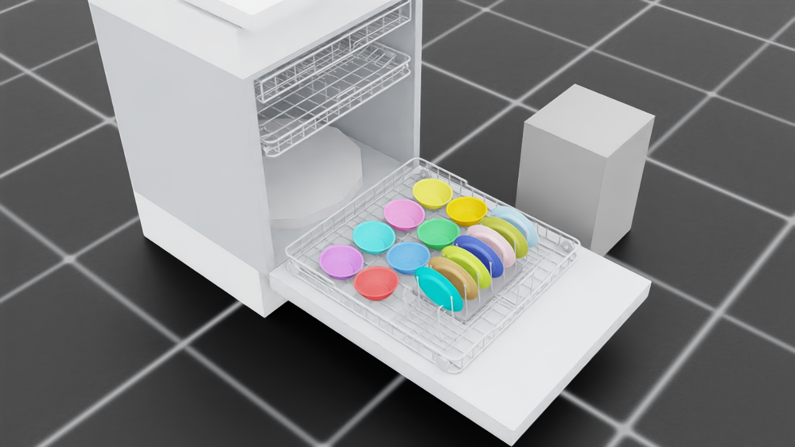

<div align="center">
  <h1 align="center"> dishwasher_sim_isaaclab </h1>
  <h3 align="center"> A physics-validated rearrangement planning benchmark (Isaac Sim) </h3>
  <p align="center">
    
    
    
    
  </p>
</div>

Run this first, about 5 minutes from a fresh clone:

```bash
scripts/tools/bootstrap.sh
```

It builds the `dishsim-isaac` image if absent, starts the container, restores the public
asset archive and runs the Kit smoke test. Pass = `[OK] ... @ side_winner` per cache and
`[RESULT] PASS` at the end. Long-form write-up of everything below:
[docs/overview.md](docs/overview.md).

## What this is

An algorithm moves one kitchen object at a time by teleport inside a dishwasher digital twin,
and physics judges every move. A placement counts only if it is collision-free (Kit-free FCL
check in milliseconds) and physically stable (Isaac settles it). The Bosch benchmark has no
robot arm and no arm motion planning; a UR5e + Robotiq arm is being brought up separately in
the Frigidaire twin ([frigidaire/docs/robot.md](frigidaire/docs/robot.md), in progress
2026-09-29). Ground truth: `dishsim/compat.py` computes the provably minimum move count, so
results are optimality gaps, not rankings.

<table align="center"><tr><td align="center">
<br/>
a goal arrangement, 15 items, physically settled
</td></tr></table>

## Run the benchmark

Every Kit command goes through `scripts/run_kit.sh`, every Kit-free one through
`scripts/run_py.sh`; both forward into the container. Judge each Kit run by its log line
`[RESULT] PASS` and the absence of tracebacks. Exit codes lie.

1. Pick a GPU (shared machine): `nvidia-smi`, then `DISHSIM_GPU=<n> docker compose -f docker/compose.yaml up -d`.
2. Bring-up: `scripts/tools/bootstrap.sh` (5 min).
3. Only after restoring an archive tag dated before 2026-09-10 (later tags already carry the exact `E_door_4` pieces, see [docs/known_limitations.md](docs/known_limitations.md)): re-decompose the two shipped pieces that predate a parameter change (seconds each):
   ```bash
   scripts/run_py.sh scripts/setup/decompose_meshes.py --machine bosch800 --placement side_winner --scenario placement --object plate
   scripts/run_py.sh scripts/setup/decompose_meshes.py --machine bosch800 --placement side_winner --scenario placement --object bowl
   ```
4. Gates: `scripts/run_py.sh -m pytest tests/` (65 pass, about 70 s) and the capacity check in [docs/overview.md](docs/overview.md#3-quickstart--reproduce-the-results) (prints `total 39`).
5. Generate, picture, solve (Kit, a few minutes each):
   ```bash
   scripts/run_kit.sh scripts/setup/gen_instances.py --headless --mode perturbed --state placement --n 3 --seed 0
   scripts/run_kit.sh scripts/evaluation/instance_views.py --headless --enable_cameras --instance results/instances/bosch800/placement/perturbed_s0.json
   scripts/run_kit.sh scripts/experiment/run_rearrange.py --headless --enable_cameras --video --instances "results/instances/bosch800/placement/*.json" --algorithms greedy
   ```
   Expected: 3 of 3 solved in 9 moves of 45, 0 aborts, 0 infeasible commands.

Difficulty tiers: `gen_instances.py --cell <easy|medium|hard>`, `run_rearrange.py --cells ...`,
then `scripts/run_py.sh scripts/evaluation/compare_algorithms.py` → `results/compare/summary.md`.

## Add your algorithm

1. Implement `reset(instance, world)` and `next_move(obs)` in one class (`src/dishsim/rearrange.py` shows the greedy baseline).
2. Register it in `ALGORITHMS` in `scripts/experiment/run_rearrange.py`. Accept `seed=` if stochastic.
3. Run step 5 above with `--algorithms <name>`.

The greedy baseline is one-blocker lookahead; swap cycles defeat it.

## Results on record

| Claim | Evidence |
|---|---|
| Benchmark runs closed-loop: the 2026-09-04 tier benchmark of record (greedy_offline and rrt_connect on easy / medium / hard = 5 / 10 / 15 items, 10 instances each, no move budget, 60 s planning budget) solved 39 of 60: easy 10/10 for both, medium 8/10 for both, hard 1/10 (greedy_offline) and 2/10 (rrt_connect). Provable optima on the three pinned perturbed instances are 9/9/9 (`tests/test_compat.py`; the 2026-08-30 "3/3 in 9 moves" greedy run left no records) | `results/rearrange/bosch800/placement/`, `results/compare/summary.md`, episode MP4s under `media/rearrange/` |
| A planned Bosch 800 full load settles with 1.1 mm max drift | `docs/figures/bosch800_loaded_reveal.png` |
| Settle-reliability gates: bowls 59/60 upright; scaled cups 49/82 and tumblers 64/88 wedge in the wire lattice, so drinkware sits out of the certified count | [docs/known_limitations.md](docs/known_limitations.md) |

The Frigidaire FDPC4221AS, an independently authored twin under `frigidaire/` ([source README](frigidaire/README.md)), no longer has rows in this table. Its v3-era experiments (single-dish random drops, multi-dish randomized states, organized counterparts, the first exposure and planner runs) ran on the 52/72-tine photo-fitted racks, before the 2026-09-22 and 2026-09-28 rebuilds, and were retired on 2026-09-29: the code is in git history (last commit before the retirement: `4455813`) and the result folders are held on the 2 TB drive under `dishsim/_trash_20260929/` until 2026-10-29. Current documents: [geometry](frigidaire/docs/geometry.md) (racks re-measured 2026-09-28), the [HOTEC rearrangement benchmark](frigidaire/docs/hotec_bench.md) on that twin, the [exposure scorer](frigidaire/docs/exposure.md) and the [arm bring-up](frigidaire/docs/robot.md) (in progress).

## Where things live

| Path | What |
|---|---|
| `src/dishsim/` | benchmark package (`rearrange.py` core, `compat.py` optima, `collision_world.py` FCL, `config.py`) |
| `scripts/{setup,evaluation,experiment,tools}/` | the pipeline stages, in order |
| `frigidaire/` | the Frigidaire twin: generator, loaders, experiments, `docs/`, tests (tracked in git) |
| `assets/ build/ media/ results/ logs/ outputs/` | gitignored symlinks to the 2 TB drive; root disk gains nothing (`build/` holds the only copy of the current Frigidaire twin build) |
| `docs/figures/` | the only tracked media, with provenance in its README |
| `experiments/` | symlink index of every experiment: machine → experiment → trial, one README per entry; nothing lives there |

## Five rules that bite

1. Never change the Isaac Sim 4.5.0 / Isaac Lab 2.1.1 pins; the host driver caps Isaac at 4.5.0.
2. Never edit the frozen cache anchors in `config.py`; they key every shipped cache. Hashed knobs mean a Kit rebake ([docs/overview.md §4](docs/overview.md#4-notes-for-running-and-extending)).
3. `config_hash` is not the only cache key: a static-CoACD edit is invisible to the staleness check, and a box restored from an archive tag older than 2026-09-10 needs step 3 above once.
4. Every Kit script calls `dishsim.media.release_sim_for_close()` before closing, or shutdown spins forever and the `[RESULT]` line is lost.
5. Files the container writes are root-owned: delete with `docker exec dishsim-isaac rm`, never host sudo.

## Reference documentation

| Doc | Contents |
|---|---|
| [docs/overview.md](docs/overview.md) | The long-form README: benchmark definition, environment, archive, quickstart gates, results, limitations, licenses |
| [docs/environment.md](docs/environment.md) | Stack, container recipe, Isaac Lab 2.1 API notes, launcher landmines (canonical) |
| [docs/architecture.md](docs/architecture.md) | Code structure, Kit-free vs Kit-side layering |
| [docs/success_criteria.md](docs/success_criteria.md) | Slot model per placement mode, settle tolerances, capacity |
| [docs/known_limitations.md](docs/known_limitations.md) | Negative results and open items, with measurements |
| [docs/extending.md](docs/extending.md) | Add an object class, placement mode or machine state |
| [docs/bosch800_source_data.md](docs/bosch800_source_data.md) | Every Bosch 800 number with provenance |
| [docs/joint_report.md](docs/joint_report.md) | Measured joint and articulation numbers of the ArtVIP baseline dishwasher (`dishwasher_2`), from the retired `inspect_scene.py` |
| [docs/bosch800_asset.md](docs/bosch800_asset.md) | The standalone Bosch 800 USD asset |
| [docs/hotec_wheatstraw_asset.md](docs/hotec_wheatstraw_asset.md) | The HOTEC wheat-straw plate/bowl/cup USD assets: parameters, capacities, Frigidaire load render |
| [frigidaire/docs/geometry.md](frigidaire/docs/geometry.md) | Current Frigidaire FDPC4221AS rack, basket and appliance geometry (tape re-measured 2026-09-28) |
| [frigidaire/docs/hotec_bench.md](frigidaire/docs/hotec_bench.md) | HOTEC rearrangement benchmark in the Frigidaire twin: tiers, tracks, decisions, landmines |
| [frigidaire/docs/robot.md](frigidaire/docs/robot.md) | UR5e + Robotiq 2F-85 arm bring-up in the Frigidaire twin (work in progress, 2026-09-29) |
| [frigidaire/docs/exposure.md](frigidaire/docs/exposure.md) | Exposure scorer reference for agents ([quickstart](frigidaire/docs/exposure_quickstart.md) for humans) |

## Assets and licenses

This project builds on the following open-source projects and datasets; visit each URL for its license:

1. https://github.com/isaac-sim/IsaacLab, simulation framework (v2.1.1 API)
2. https://github.com/isaac-sim/IsaacSim, simulator and PhysX ground truth
3. https://huggingface.co/datasets/X-Humanoid/ArtVIP, the articulated `dishwasher_2` asset (Apache-2.0)
4. https://www.ycbbenchmarks.com, YCB Object & Model Set, Calli et al., "The YCB Object and Model Set" (IEEE ICAR 2015): textured `google_16k` scans for plate, bowl, cups, cutlery and spatula, under the YCB dataset terms
5. https://github.com/BerkeleyAutomation/python-fcl, Pan, Chitta, Manocha, "FCL: A general purpose library for collision and proximity queries" (ICRA 2012)
6. https://github.com/SarahWeiii/CoACD, Wei et al., "Approximate Convex Decomposition for 3D Meshes with Collision-Aware Concavity and Tree Search" (SIGGRAPH 2022)
7. https://github.com/mikedh/trimesh, mesh processing throughout the asset and collision pipelines

Rack geometry is procedurally generated, styled after publicly documented Whirlpool, Bosch and
Frigidaire rack designs; no third-party geometry is redistributed. Downloaded and derived
assets are never committed; the public archive `shu4dev/dishsim-assets` redistributes only
what its sources' licenses allow, with attribution.
