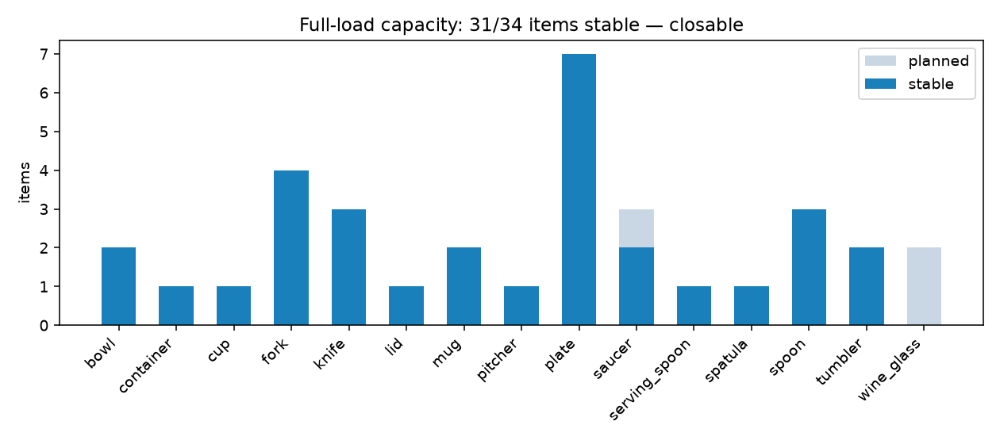
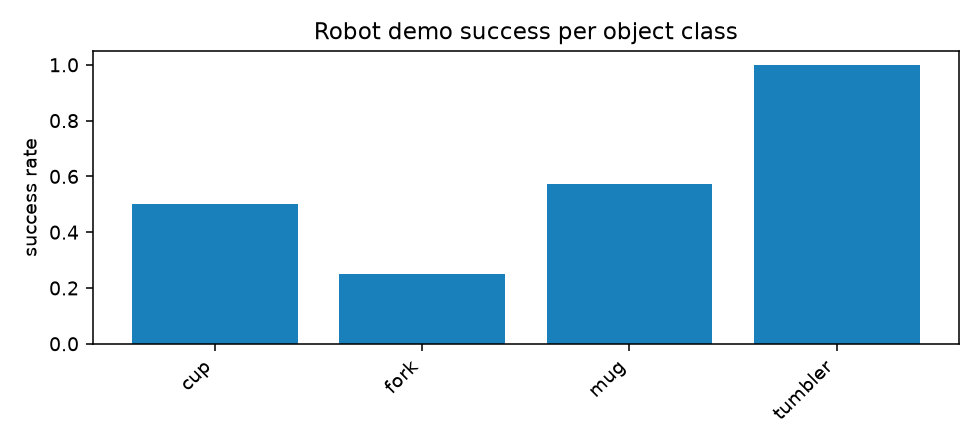

# Multi-Object Capacity Report

Generated by `scripts/31_capacity_report.py` from the trial JSONs and the capacity fill.

## Object library (scale-to-fit)

The ArtVIP dishwasher is compact (lower rack 366 x 287 mm, 154 mm inter-rack
clearance, 30 mm tine pitch); sourced objects are scaled to rack-proportional size —
the documented factor below. Dims are measured from the built asset (scripts/03), not
eyeballed.

| object | source | scale | scaled dims [mm] | source real size [mm] | mass [kg] | grasp family | placement |
|---|---|---|---|---|---|---|---|
| bowl | YCB 024_bowl | 0.68 | 110 x 110 x 37 | 159 dia x 53 | 0.15 | rim_edge | bowl_lean (lower) |
| container | procedural | 1.0 | 120 x 90 x 55 | designed | 0.11 | rim_edge | upside_down (upper) |
| cup | YCB 065-a_cups | 1.1 | 63 x 63 x 68 | 57 dia x 62 | 0.06 | rim_diam | floor_stand (lower) |
| fork | YCB 030_fork | 0.6 | 118 x 16 x 9 | 198 long | 0.03 | handle_pinch | basket_drop (basket) |
| knife | YCB 032_knife | 0.6 | 129 x 13 x 9 | 215 long | 0.04 | handle_pinch | basket_drop (basket) |
| lid | procedural | 1.0 | 126 x 96 x 8 | designed | 0.06 | edge_pinch | flat_lay (upper) |
| mug | Isaac YCB 025_mug | 1.0 | 117 x 81 x 93 | 80 dia x 81 | 0.118 | rim_diam | floor_stand (lower) |
| pitcher | YCB 019_pitcher_base | 0.5 | 75 x 72 x 121 | 242 tall | 0.15 | rim_diam | floor_stand (lower) |
| plate | YCB 029_plate | 0.54 | 140 x 141 x 14 | 258 dia x 27 | 0.2 | edge_pinch | plate_slot (lower) |
| saucer | YCB 029_plate | 0.42 | 109 x 110 x 11 | 258 dia x 27 | 0.12 | edge_pinch | plate_slot (lower) |
| serving_spoon | procedural | 1.0 | 180 x 40 x 12 | designed | 0.06 | handle_pinch | basket_drop (basket) |
| spatula | YCB 033_spatula | 0.45 | 140 x 38 x 15 | 311 long | 0.05 | handle_pinch | flat_lay (upper) |
| spoon | YCB 031_spoon | 0.6 | 117 x 25 x 13 | 195 long | 0.03 | handle_pinch | basket_drop (basket) |
| tumbler | procedural | 1.0 | 60 x 60 x 105 | designed | 0.09 | rim_diam | floor_stand (lower) |
| wine_glass | procedural | 1.0 | 58 x 58 x 120 | designed | 0.1 | stem_pinch | stem_scallop (upper) |

## Robot pick-and-place demos

One scene per class (`scripts/20 --object <name> --scenario placement`); the carried
object rides a calibrated contact pinch with the hidden wrist weld bearing the load
(edge-pinch discs start welded — grasp acquisition for flat-lying plates is out of
scope, as in v0). Every trial has an MP4 + final still under `media/F/`.

| object | trials | success | grasp aperture [rad] | steady pinch [N] | plan time [s] | failure stages |
|---|---|---|---|---|---|---|
| cup | 2 | 1/2 | 0.264 | [2.0, 24.3] | 0.9-2.5 | unstable-after-release |
| fork | 4 | 1/4 | 0.74 | [0.5, 40.0] | 6.0-20.1 | execution-collision, planner-timeout |
| mug | 7 | 4/7 | 0.058 | [1.7, 15.4] | 2.1-14.6 | execution-collision, no-goal-config |
| tumbler | 2 | 2/2 | 0.303 | [1.6, 14.7] | 1.5-2.3 | - |

## Full-load capacity (physics fill)

Planned **34** items from the deterministic fill plan
(`dishsim.fill_plan`, FCL-validated); **31** settled stably.
Closability (motorized slide-in of both racks to the stowed position): **CLOSABLE** (rack stow error 5.9 mm, 0 item(s) displaced).

| object | planned | stable |
|---|---|---|
| bowl | 2 | 2 |
| container | 1 | 1 |
| cup | 1 | 1 |
| fork | 4 | 4 |
| knife | 3 | 3 |
| lid | 1 | 1 |
| mug | 2 | 2 |
| pitcher | 1 | 1 |
| plate | 7 | 7 |
| saucer | 3 | 2 |
| serving_spoon | 1 | 1 |
| spatula | 1 | 1 |
| spoon | 3 | 3 |
| tumbler | 2 | 2 |
| wine_glass | 2 | 0 |
| **total** | **34** | **31** |

Unstable at fill (parked, honest capacity): saucer_00, wine_glass_00, wine_glass_01

## Media

| what | path |
|---|---|
| loaded machine (front) | `media/fill/loaded_front.png` |
| loaded machine (top) | `media/fill/loaded_top.png` |
| loaded machine (iso) | `media/fill/loaded_iso.png` |
| fill timelapse | `media/fill/fill_timelapse.mp4` |
| orbit clip | `media/fill/orbit.mp4` |
| cup demo trial_07_00_0 | `media/F/placement/cup/trial_07_00_0.mp4` |
| cup demo trial_02_00_0 | `media/F/placement/cup/trial_02_00_0.mp4` |
| fork demo trial_01_01_0 | `media/F/placement/fork/trial_01_01_0.mp4` |
| fork demo trial_00_01_0 | `media/F/placement/fork/trial_00_01_0.mp4` |
| fork demo trial_01_00_0 | `media/F/placement/fork/trial_01_00_0.mp4` |
| fork demo trial_00_00_0 | `media/F/placement/fork/trial_00_00_0.mp4` |
| mug demo trial_07_01_0 | `media/F/trial_07_01_0.mp4` |
| mug demo trial_07_00_0 | `media/F/trial_07_00_0.mp4` |
| mug demo trial_02_01_0 | `media/F/trial_02_01_0.mp4` |
| mug demo trial_02_00_0 | `media/F/trial_02_00_0.mp4` |
| mug demo trial_00_00_0 | `media/F/trial_00_00_0.mp4` |
| mug demo trial_02_01_0 | `media/F/placement/trial_02_01_0.mp4` |
| mug demo trial_02_00_0 | `media/F/placement/trial_02_00_0.mp4` |
| tumbler demo trial_07_00_0 | `media/F/placement/tumbler/trial_07_00_0.mp4` |
| tumbler demo trial_02_00_0 | `media/F/placement/tumbler/trial_02_00_0.mp4` |
| object library sheet | `media/assets/library_sheet.png` |
| per-class calibrations | `media/C2/<object>/` |

