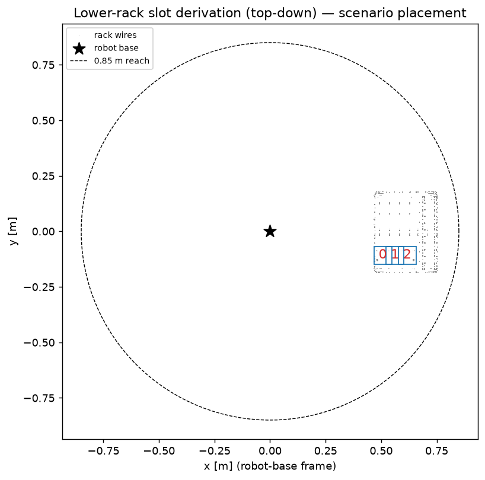
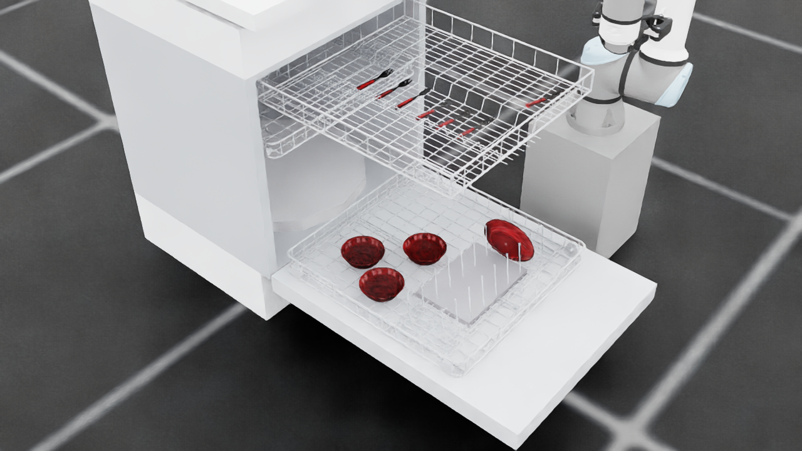

# Project overview (long form)

The full write-up that the top-level README carried until 2026-09-17: benchmark definition,
environment, archive, quickstart with gates, results with evidence, limitations and licenses.
The README is now the short, action-first version; this file is the reference. Links resolve
from `docs/` (rebased 2026-09-29), and the Frigidaire v3-era block that stood at the top of §1
was replaced by a pointer on the same day.

---

## 1 Overview

The independently authored **Frigidaire FDPC4221AS** twin lives in its own package,
`code/frigidaire/` ([source README](../code/frigidaire/README.md)); its current build is staged in
`data/build/frigidaire_collection/` (`data/build/` is a symlink onto the 2 TB drive; this is the only
copy of the current build, and no archive tarball contains it). Its v3-era experiments
(single-dish random drops, multi-dish randomized states, organized counterparts, the first
exposure and planner runs) ran on the 52/72-tine photo-fitted racks, before the 2026-09-22
and 2026-09-28 rebuilds, and were retired on 2026-09-29: the code is in git history (last
commit before the retirement: `4455813`), the result folders are held until 2026-10-29 in
`_trash_20260929/` on the 2 TB drive, and none of their numbers are quoted here. Current
documents: [geometry](../code/frigidaire/docs/geometry.md) (racks re-measured 2026-09-28), the
[HOTEC rearrangement benchmark](../code/frigidaire/docs/hotec_bench.md) on that twin, the
[exposure scorer](../code/frigidaire/docs/exposure.md) and the
[arm bring-up](../code/frigidaire/docs/robot.md) (UR5e + Robotiq 2F-85, in progress 2026-09-29).

This repo is a **benchmark for dishwasher rearrangement planning**: given a physically
settled initial arrangement and an exact target arrangement in an articulated dishwasher
(experiments run on a self-authored **Bosch 800 digital twin** with a third rack; the ArtVIP
baseline machine ships too), an algorithm moves one object at a time by **teleport** and
**physics judges every move**. The 14-class kitchen-object library is scaled to the machines.
A placement is feasible when it is

- **collision-free** — a Kit-free FCL world (`dishsim.collision_world`) answers "would this
  object, teleported to this pose, interpenetrate the machine or an already-placed object?"
  in milliseconds, in any plain Python process; and
- **physically stable** — Isaac Sim settles the planned arrangement and judges it against
  per-mode measured tolerances (drift, tilt, seating height, rack closability).

The Bosch benchmark has no robot arm and no arm motion planning — Isaac Sim's only jobs are
physics validation and evidence rendering. (The earlier UR5e + OMPL manipulation stack is not
on this branch: it lives on `main` and `on-corrallab` and in git history. The RL door-opening
pipeline, `scripts/rsl_rl/` and `source/dishwasher_tasks/`, was removed on 2026-07-30 in
commit `2628cfc` and lives in git history only. A UR5e + Robotiq arm is being brought up
separately in the Frigidaire twin: [code/frigidaire/docs/robot.md](../code/frigidaire/docs/robot.md),
in progress 2026-09-29.)

The pipeline, mirrored by the stage folders under `code/` ([code/README.md](../code/README.md)):

| Stage | Command | Does | Writes |
|---|---|---|---|
| **Plan** | in-process (`capacity.plan_full_load`) | Kit-free greedy capacity plan: derive slots live, pre-scan placeability, certify the load jointly, gate on z-budget + measured settle reliability | (consumed live by Generate) |
| **Generate** | `initialization/bosch/gen_instances.py` | Seeded rearrangement instances (perturbed plans / random drops), physically settled and saved as artifacts | `data/results/instances/<machine>/<state>/` |
| **Problem images** | `initialization/bosch/instance_views.py` | One instance's initial-vs-goal stills — the problem, where the episode video is the solving | `data/media/instances/<machine>/<state>/<cell>/` (legacy instances without a cell: flat in `<state>/`) |
| **Benchmark** | `planner/bosch/run_rearrange.py` | Closed-loop algorithm episodes: every move teleports + settles; abort on first fatal fault; move budget; `--video` per-episode MP4 | `data/results/rearrange/<machine>/<state>/`, `data/media/rearrange/` |

<table align="center">
  <tr>
    <td align="center">
      
      <br/>
      Slot derivation from rack geometry (retired producer, git history)
    </td>
    <td align="center">
      
      <br/>
      A planned Bosch 800 load, physically settled, max drift 1.1 mm (retired producer, git history)
    </td>
  </tr>
</table>

### 1.1 The benchmark

- **Instance** (saved JSON, seeded — every algorithm sees byte-identical inputs): a machine
  rack state, a roster of objects at **measured settled** initial poses, and an exact target
  pose per object (the capacity plan's jointly-certified release pose, carrying its slot so
  the at-goal verdict reuses the per-mode settle tolerances).
- **Move**: `move(object, pose)` — teleport anywhere, a rack slot or the counter buffer band
  (just physical space; its finite capacity emerges from geometry, and tier instances add a
  hard occupancy cap, see §4).
- **Episode** (closed-loop): the harness FCL-pre-checks each commanded pose, executes it,
  settles physics, and hands the algorithm the measured state via `next_move(obs)`. The
  episode **aborts on the first fatal fault** — a disturbed neighbor, or a put-back that does
  not reproduce (`unstable-settle`) — or at the move budget (3× roster by default), the
  planning-time budget (60 s by default) or a loop guard (25 straight refused commands or
  failed settles). A drifting or far-off settle is a non-fatal `failed-settle`: the item is
  put back, the move counts, and the algorithm may retry. An **infeasible commanded pose is
  refused and counted** (`infeasible_commands`), not fatal: every algorithm can pre-check with
  the same oracle, so emitting one is a search error worth measuring rather than a reason to
  end the episode — ending it there would flatter pre-checking planners. A move onto a full
  counter is refused the same way (`counter-full`).
- **Scoring** per episode record: solved, fraction-at-goal, moves used, buffer-vs-goal move
  split, travel distance, planning time (per call and total), feasibility queries, seed, and
  whatever an algorithm reports through its optional `stats()` hook.
- **Ground truth**: `dishsim/compat.py` computes the **provably minimum** move count for an
  instance, so results can be quoted as an optimality gap rather than a relative ranking.
  Feasibility is pairwise-decomposable here, so a compatibility table (seconds) makes an exact
  A* cheap. Instances are per-machine artifacts (settle fixed points are engine-relative); on
  this box's three pinned perturbed instances the optima are **9, 9, 9** (`code/tests/test_compat.py`,
  re-pinned 2026-08-31) and greedy solved 3/3 in 9 moves on 2026-08-30 (that run left no
  records). It is a *geometric-relaxation* optimum — see the caveats in the module docstring.
- **Your algorithm**: one class implementing `reset(instance, world)` / `next_move(obs)`
  (`code/src/dishsim/rearrange.py`) plus one line in `ALGORITHMS` in
  `code/planner/bosch/run_rearrange.py`; accept a `seed=` kwarg if stochastic. A greedy
  baseline ships as the thing to beat — one-blocker lookahead, so swap-cycles defeat it.

### 1.3 Object library

14 classes, sourced from YCB scans or generated procedurally, then **scaled to fit** the
machines; the certified Bosch load uses plates, bowls and forks (drinkware sits out on a
measured settle-reliability gate). The full registry lives in `config.OBJECTS`; adding a
class: [docs/extending.md](extending.md).

### 1.4 Reference documentation

| Doc | Contents |
|---|---|
| [docs/environment.md](environment.md) | Hardware/software stack, container recipe, Isaac Lab 2.1 API notes, **launcher landmines (canonical)** |
| [docs/architecture.md](architecture.md) | Code structure, the Kit-free/Kit-side layering, completed one-off studies |
| [docs/success_criteria.md](success_criteria.md) | Slot model per placement mode, settle tolerances, placeable capacity |
| [docs/known_limitations.md](known_limitations.md) | Honest negative results and open items, with measured evidence |
| [docs/extending.md](extending.md) | Add an object class / placement mode / machine state |
| [docs/joint_report.md](joint_report.md) | Measured articulation numbers of the ArtVIP baseline dishwasher (`dishwasher_2`; generated by the retired inspect_scene.py, git history) |
| [docs/bosch800_source_data.md](bosch800_source_data.md) | Every Bosch 800 twin number with its provenance |
| [docs/figures/README.md](figures/README.md) | Provenance of every tracked figure (producing command + media source) |

## 2 Environment Setup

### 2.1 Prerequisites

Docker with the NVIDIA container runtime, and an NVIDIA GPU with a 535-series (or newer)
driver — the runtime environment (Isaac Sim **4.5.0** + Isaac Lab **v2.1.1**) is fully baked
into the image built by `code/util/docker/Dockerfile`, and nothing installs on the host. Developed and
validated on the corallab workstation (3× RTX 3090, driver 535.230.02, Ubuntu 20.04 — see
[docs/environment.md](environment.md)). Everything runs `--headless`; only *rendering*
additionally needs `--enable_cameras`.

### 2.2 Runtime container

```bash
docker build -f code/util/docker/Dockerfile -t dishsim-isaac:4.5.0 .   # once (skipped if present)
docker compose -f code/util/docker/compose.yaml up -d                  # long-lived container dishsim-isaac
```

The compose file keeps every bulky mutable path (assets, media, results, Kit caches,
`HF_HOME`) on `/media/corallab-s1/2tbhdd/brianshu/dishsim`; the repo's data dirs (`data/assets/`,
`data/build/`, `data/media/`, `data/results/`, `data/logs/`, `data/outputs/`) are symlinks there. On the root disk
stay the `dishsim-isaac:4.5.0` image and the container's writable layer (0.93 GiB on
2026-09-29: the isaaclab and pytest installs that every start re-applies); the root disk is
80 % used with about 182 GiB free (2026-09-29). Retired data waits in 30-day hold folders
next to `repo_data/` (`_trash_20260917/`, delete after 2026-10-17; `_trash_20260929/`, delete
after 2026-10-29; each has a `MANIFEST.txt`). Pick the least-loaded GPU per shell
(`nvidia-smi`, then `DISHSIM_GPU=<n> docker compose ... up -d` — shared machine).
`requirements-planning.txt` pins the measured working set (the table in
[docs/environment.md](environment.md) is the measurement of record); the Dockerfile
installs it plus pytest and the archive tooling into Kit's python — no venv.

### 2.3 Assets (public archive — the one-command path)

Every asset this project uses is publicly redistributable with attribution (see §7): the
ArtVIP dishwasher (Apache-2.0), YCB-scan-derived objects incl. the mug (YCB dataset terms),
and this project's own procedural props, racks and geometry caches. One command restores
all of them, no token needed:

```bash
code/util/run_py.sh code/util/tools/restore_assets.py --repo shu4dev/dishsim-assets
```

The restore downloads the archive (built props, every geometry cache — the ~1.5 h-of-Kit
part — derived dishwasher USDs), re-downloads the ArtVIP originals, validates every cache's
`config_hash` against the current `config.py`, and runs the test suite. It extracts `data/assets/`
members only (`EXTRACT_PREFIXES` in `restore_assets.py`): the `assets` tarball also packs the
recorded Bosch instances, episode records and comparison table (`data/results/`), but they are
skipped, so a restored box regenerates instances with `gen_instances.py`; the same rule makes
`--with_media` download a tarball whose members are all skipped, so the command omits it.
`data/assets/`, `data/media/`, `data/results/` are gitignored; only curated figures under `docs/figures/`
are tracked.

**The archive ships the complete Bosch 800 digital-twin world**: collision caches for all
five Bosch rack states baked at the measured `side_winner` anchor
(`data/assets/cache/machines/bosch800/`); the machine USDs re-author on demand at import. Tags
dated 2026-09-10 or later carry the exact `E_door_4` CoACD pieces and need no post-restore
step; an OLDER tag's pieces predate a static-CoACD param change, so run
`decompose_meshes.py` once per cached context (quickstart step 2; the loud
`missing CoACD pieces` load error names the fix). `--machine bosch800` switches the whole
stack via `config.apply_machine`; `--placement side_winner` selects the frozen base-frame
anchor the Bosch caches are expressed in. Bosch numbers and their provenance:
[docs/bosch800_source_data.md](bosch800_source_data.md).

**Standalone Bosch 800 asset (opt-in tarball kinds).** The same dataset also carries an
independently authored, redistributable Bosch 800 USD (`bosch800.usdc` + rack exports +
textures) and its validation evidence, as two extra tarball kinds that `latest.json` names
beside the cache archive; every file is sha256-verified against the tarball manifest on
restore. It is a visual/manipulation asset, not (yet) the benchmark machine — see
[docs/bosch800_asset.md](bosch800_asset.md):

```bash
code/util/run_py.sh code/util/tools/restore_assets.py --kinds models            # ~3.5 MB
code/util/run_py.sh code/util/tools/restore_assets.py --kinds models evidence   # +74 MB stills/video
```

Producer side (re-cut + publish after an asset revision): `code/util/tools/archive_assets.py
--kinds models evidence [--upload]`; the upload merges into the remote `latest.json`.

**One-command bring-up** — everything in §2.2–2.3 (image build if absent, container start,
archive restore + cache validation) in one idempotent script:

```bash
code/util/tools/bootstrap.sh          # fresh clone -> planning in ~5 minutes
```

The division of labor is deliberate: everything expensive **runs once and ships in the
archive** — geometry extraction and CoACD decomposition (~1.5 h of Kit across both machines).
What a clone actually iterates on — instances and algorithms — plans per-call against the
restored caches. If a run asks you to bake, either the archive is stale for your config or
you changed a hashed value (see §4); baking during a benchmark sweep is always a smell.

### 2.4 Rebaking after a config change

The shipped caches serve reproduction as-is; a hashed-config change invalidates loudly and
rebuilds with the two-stage `extract_geometry` → `decompose_meshes` pair (§4). If rebuilding
the world from nothing instead of restoring, first fetch the ArtVIP source:

```bash
code/util/run_py.sh -c "from huggingface_hub import snapshot_download; \
  snapshot_download(repo_id='X-Humanoid/ArtVIP', repo_type='dataset', \
  allow_patterns=['Articulated_objects/major_appliances/dishwasher/**'], local_dir='data/assets/artvip')"
```

(The one-time authoring/inspection scripts live in git history; the archive ships their
outputs and `docs/joint_report.md` records the measured numbers.)

### 2.5 Verify the install

```bash
code/util/run_kit.sh code/util/tools/kit_smoke.py --headless --enable_cameras
code/util/run_py.sh -m pytest code/tests/
code/util/run_py.sh -m pytest code/frigidaire/tests/
```

`kit_smoke.py` proves the collision stack imports *inside* the Kit process and that headless
camera capture produces non-black frames (bootstrap runs it automatically). `code/tests/` is
**8 Kit-free files, 65 tests, about 70 s**: the two frozen-invariant pins (the tripwires that
protect the shipped caches), the compat ground truth, the benchmark driver's and the RRT
planners' toy-oracle checks, the instance sampler's tier knobs, the archive tool's tarball
selection and the HOTEC generator's properties.

> **Note:** `PYTEST_DISABLE_PLUGIN_AUTOLOAD=1` is required outside Kit — the site-packages
> carry hydra, whose pytest plugin breaks collection there. `code/util/run_py.sh` bakes it in.

## 3 Quickstart — reproduce the results

The end-to-end path from a fresh clone to the Results table in §5. Judge every Kit run from
its log (`[RESULT] PASS`, no tracebacks) — exit codes lie (`isaaclab.sh -p` exits 0 on
crashes).

```bash
# 0. shared box: pick the least-loaded GPU
nvidia-smi
DISHSIM_GPU=<n> docker compose -f code/util/docker/compose.yaml up -d

# 1. bring-up: image build if absent + container + archive restore + the kit_smoke gate
code/util/tools/bootstrap.sh
#    GATE: restore prints "[OK] ... @ <placement>" per cache, then kit_smoke "[RESULT] PASS"

# 2. only after restoring an archive tag dated before 2026-09-10 (later tags already carry the
#    exact E_door_4 pieces): re-decompose once per restored context.
#    The anchor MUST match the restore log's "@ side_winner" — a wrong anchor reads as
#    "cache is stale".
code/util/run_py.sh code/initialization/bosch/decompose_meshes.py \
    --machine bosch800 --placement side_winner --scenario placement --object plate
code/util/run_py.sh code/initialization/bosch/decompose_meshes.py \
    --machine bosch800 --placement side_winner --scenario placement --object bowl

# 3. gates: tests + Kit-free capacity sanity
code/util/run_py.sh -m pytest code/tests/          # GATE: 65 passed (about 70 s)
code/util/run_py.sh -c "
import sys; sys.path.insert(0, 'code/src')
from dishsim import config
config.apply_machine('bosch800'); config.apply_base_placement('side_winner')
from dishsim import capacity
print('total', capacity.plan_full_load(log=lambda *_: None).total_items)"
#    GATE: total 39 (placement 15 = plate 7 + bowl 8)

# 4. generate settled instances (saved artifacts — every algorithm sees identical inputs)
code/util/run_kit.sh code/initialization/bosch/gen_instances.py --headless \
    --mode perturbed --state placement --n 3 --seed 0

# 5. the PROBLEM: one instance's initial + goal stills
code/util/run_kit.sh code/initialization/bosch/instance_views.py --headless --enable_cameras \
    --instance data/results/instances/bosch800/placement/perturbed_s0.json

# 6. the SOLVING: closed-loop episodes with per-episode MP4s
code/util/run_kit.sh code/planner/bosch/run_rearrange.py --headless --enable_cameras --video \
    --instances "data/results/instances/bosch800/placement/*.json" --algorithms greedy
#    GATE: "[RESULT] PASS"; expect 3/3 solved in 9 moves of 45, 0 aborts, 0 infeasible commands
```

Re-rolls during step 4 are healthy (the reproduction gate re-settling an arrangement);
init-mismatch storms are not. Fault/reset thresholds live as module constants in
`code/src/dishsim/rearrange.py` (deliberately outside `config.py`, so they can never touch
`config_hash`); widen only against a measurement.

## 4 Notes for running and extending

**Difficulty tiers** (`code/src/dishsim/tiers.py`): 3 presets (easy / medium / hard) + 9
one-knob ablation cells off medium, over four knobs — roster size/mix, a hard
**counter-occupancy cap** (6/3/1, ablation 0; enforced by the driver, visible to
algorithms via `obs["counter_cap"]`/`["counter_count"]`), displaced fraction, and authored
2-3-swap-cycles. Every tier instance ships with per-object goal ROTATIONS sampled (the
goal tableau is deliberately unaligned) and a **cap-aware provable optimum** in its meta
(`compat.optimal_moves(counter_cap=)` — status distinguishes proven-unsolvable from
search-bound). Generate with `gen_instances.py --cell <name>`, run with
`run_rearrange.py --cells <names>`, aggregate with
`code/util/run_py.sh code/planner/bosch/compare_algorithms.py` →
`data/results/compare/summary.{csv,md}`.


Every multi-object render tints objects **per item** (`config.item_color`): the sourced props
share one dark-red material, so an untinted 15-item load is unreadable. A colour follows the
item id, so the same object keeps it across the initial still, the goal still and the episode
video. Tinting is visual only and never touches physics or collision geometry.

An algorithm implements `reset(instance, world)` / `next_move(obs) -> Move | None`
(`code/src/dishsim/rearrange.py`; register it in `ALGORITHMS` in `run_rearrange.py`; accept a
`seed=` kwarg if stochastic). Every move teleports one object, settles `SETTLE_STEPS_MOVE`
physics steps, and the episode ABORTS on the first fatal fault — a disturbed neighbor or an
`unstable-settle` put-back — or at the move budget; a drifting settle is a non-fatal
`failed-settle` (item put back, the move counts). An infeasible commanded pose is refused and
counted (`infeasible_commands`), not fatal. The greedy baseline is the thing to beat —
one-blocker lookahead, so swap-cycles defeat it.

**Rebaking after a hashed-config change** (rack params, machine geometry, an object spec — or
a FROZEN CACHE ANCHOR, which you must not touch): the affected caches invalidate loudly and
rebuild with the two-stage pair, per (object, state):

```bash
code/util/run_kit.sh code/initialization/bosch/extract_geometry.py --headless \
    --machine bosch800 --placement side_winner --scenario <state> --object <class>
code/util/run_py.sh code/initialization/bosch/decompose_meshes.py \
    --machine bosch800 --placement side_winner --scenario <state> --object <class>
```

Restore the public archive any time with
`code/util/run_py.sh code/util/tools/restore_assets.py --repo shu4dev/dishsim-assets`
(the producer side is `code/util/tools/archive_assets.py`).

## 5 Results

Every claim maps to a recorded artifact; artifacts live under the gitignored `data/results/` and
`data/media/` trees.

| Claim | Run / artifact | Evidence |
|---|---|---|
| **The benchmark runs closed-loop** (corallab, 2026-09-04 tier benchmark of record): greedy_offline and rrt_connect on easy / medium / hard (5 / 10 / 15 items, 10 instances each, no move budget, 60 s planning budget) solve **39 of 60** — easy 10/10 for both, medium 8/10 for both, hard 1/10 (greedy_offline) and 2/10 (rrt_connect). Provable optima on the three pinned perturbed instances are 9/9/9 (`compat.optimal_moves`, `code/tests/test_compat.py`); the 2026-08-30 "greedy 3/3 in 9 moves" run left no records | `data/results/rearrange/bosch800/placement/` (60 records), `data/results/compare/summary.md` | `data/media/rearrange/bosch800/placement/` (11 episode MP4s, illustrative reruns of a subset of the episodes), `data/media/instances/bosch800/placement/` (initial vs goal) |
| **Bosch 800 full load settles**: a planned multi-rack load teleported to its release poses settles with max drift 1.1 mm — the plan's poses are physically self-consistent | episode-era artifact of record (robot-era media, retired; HF archive + git history) | `docs/figures/bosch800_loaded_reveal.png` |
| **Measured settle-reliability gates**: bowls 59/60 upright on the Bosch lower rack; scaled cups 49/82 and tumblers 64/88 wedge into the OEM wire lattice — which is why drinkware sits out of the certified Bosch count | probe campaign of record (records kept outside the repo roots, in `/media/corallab-s1/2tbhdd/brianshu/dishsim/robot_era_evidence/results/plate_settle/`; the current archive tarballs, tag `20260910_b3584ae`, do not carry them); gates frozen in `capacity.MEASURED_SETTLE_RELIABILITY` | [docs/known_limitations.md](known_limitations.md) |

## 6 Known limitations

The honest edges, each with measured evidence: scaled drinkware does not stand reliably on
the Bosch OEM wire lattice; the loaded lower rack cannot be driven back over the door sill;
the stemware lie-in never settles. Added 2026-08-28: `config_hash` is **not** the only cache
key (a static-CoACD change is invisible to the staleness check, so a box restored from an
archive tag older than 2026-09-10 must re-run `decompose_meshes.py` once); CoACD's manifold
preprocess inflates authored bodies by millimetres of phantom volume; only the `placement`
rack state is Kit-validated; the move model has **no insertion-path gate**, so blocking and
non-monotonicity are unrepresentable; the stowed lower
rack interpenetrates the tub; and capacity is capped by the half-scale dish library and a
single-rank plate bank rather than by the machine. Details and next levers:
[docs/known_limitations.md](known_limitations.md).

Adding an **object class**, **placement mode**, or **machine state**:
[docs/extending.md](extending.md).

## 7 Assets and licenses

This project builds on the following open-source projects and datasets. Please visit the URLs
for their respective licenses:

1. https://github.com/isaac-sim/IsaacLab — simulation framework (the v2.1.1 API this targets)
2. https://github.com/isaac-sim/IsaacSim — simulator and PhysX ground truth
3. https://huggingface.co/datasets/X-Humanoid/ArtVIP — the articulated `dishwasher_2` asset
   (Apache-2.0)
4. https://www.ycbbenchmarks.com — YCB Object & Model Set, Calli et al., *"The YCB Object and
   Model Set"* (IEEE ICAR 2015): textured `google_16k` scans for plate, bowl, cups, cutlery
   and spatula, used under the YCB dataset terms
5. https://github.com/BerkeleyAutomation/python-fcl — Pan, Chitta, Manocha, *"FCL: A general
   purpose library for collision and proximity queries"* (ICRA 2012): the Kit-free collision
   world
6. https://github.com/SarahWeiii/CoACD — Wei et al., *"Approximate Convex Decomposition for 3D
   Meshes with Collision-Aware Concavity and Tree Search"* (SIGGRAPH 2022)
7. https://github.com/mikedh/trimesh — mesh processing throughout the asset and collision
   pipelines

Rack geometry is procedurally generated, styled after publicly documented Whirlpool, Bosch and
Frigidaire rack designs (design reference only; no third-party geometry is redistributed).

Downloaded and derived assets are never committed (`data/assets/`, `data/media/`, `data/results/` are
gitignored); the public archive redistributes only what its sources' licenses allow, with
attribution.
