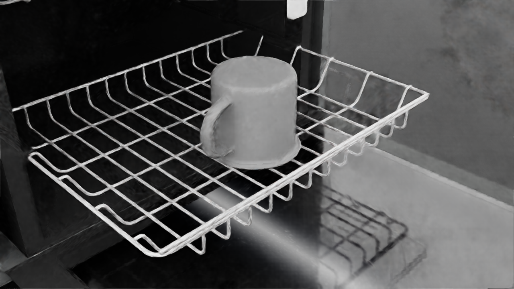
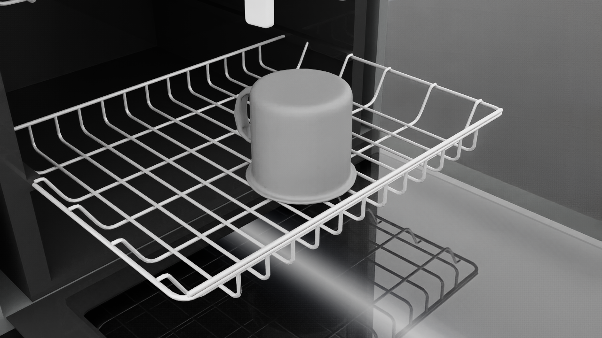

# v0 report — OMPL placement planning (dishwasher lower rack)

Task: UR5e + Robotiq 2F-85 with a YCB mug (plate stand-in; `029_plate` is not in the
Isaac 6.0 asset bucket) welded to the TCP; RRT-Connect plans a collision-free path to a
standing slot on the extended lower rack; the weld is released and the placement must
satisfy [success_criteria.md](success_criteria.md). Stack: Isaac Sim 6.0.1 + Isaac Lab
3.0 (execution/ground truth), OMPL 2.0.1 + python-fcl 0.7 + CoACD 1.0 (planning),
hand-rolled analytic UR5e IK validated against Pinocchio (see docs/environment.md).

## Headline numbers

- **Success rate: 2/2 (100 %)** over 1 slots x 1 seeds
- Plan time [s]: mean 0.33, median 0.33, p95 0.47, max 0.38 (budget 5.0 s)
- Path length [rad]: mean 9.25, median 9.25, p95 11.25, max 9.99
- Final placement error: lateral [mm] mean 4.0, median 4.0, p95 10.6, max 6.4; tilt [deg] mean 0.00, median 0.00, p95 0.00, max 0.00
- FCL collision world: 98 % agreement with Isaac contacts (0 non-conservative mismatches over 200 configs), ~0.2 ms/query — see media/D/parity_results.json

## Per-slot results

| slot | trials | successes | rate | note |
|---|---|---|---|---|
| 2 | 2 | 2 | 100 % |  |

## Failure breakdown

| stage | count |
|---|---|
| no-goal-config | 0 |
| grasp-fault | 0 |
| planner-timeout | 0 |
| execution-collision | 0 |
| release-fault | 0 |
| retract-collision | 0 |
| unstable-after-release | 0 |

Goal-config scarcity per slot (the rejection funnels) is recorded in
`assets/cache/slots/goal_sets.json`; deep-interior slots yield zero collision-free
goals because the arm cannot descend into the machine cavity — expected signal, not a
pipeline defect.

## Curated figures

## Media gallery (full evidence on disk, gitignored)

| trial | slot | seed | outcome | stage | plan [s] | video | final still |
|---|---|---|---|---|---|---|---|
| trial_02_00_0 | 2 | 0 | SUCCESS | — | 0.38 | media/F/trial_02_00_0.mp4 | media/F/trial_02_00_0_final.png |
| trial_02_00_1 | 2 | 0 | SUCCESS | — | 0.271 | media/F/trial_02_00_1.mp4 | media/F/trial_02_00_1_final.png |
