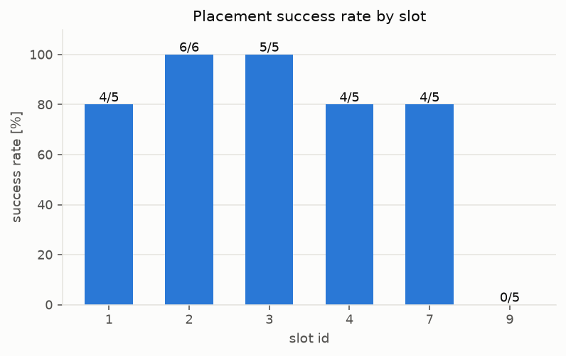
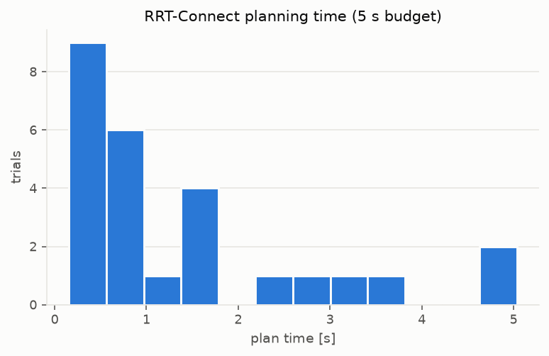
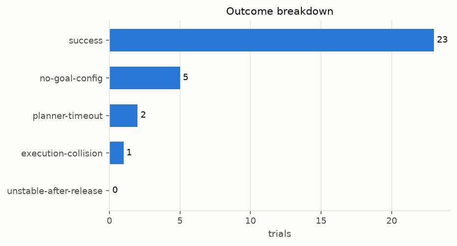
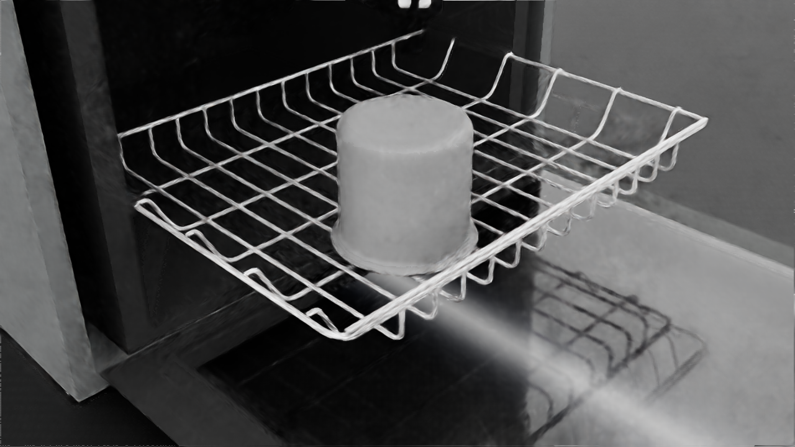
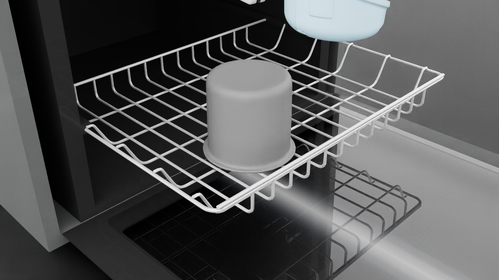
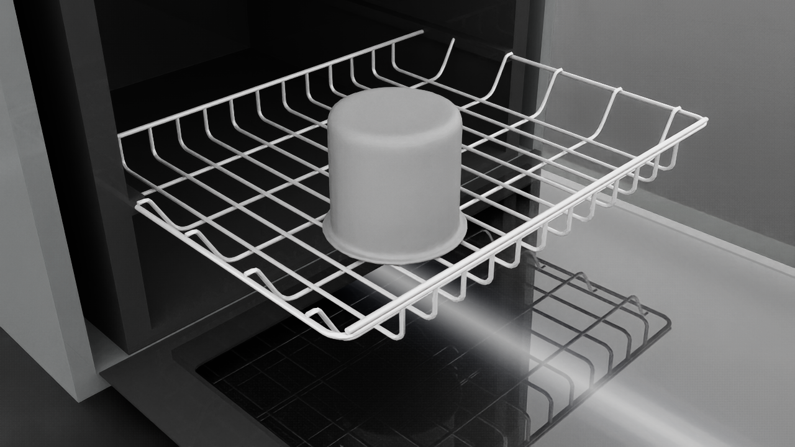
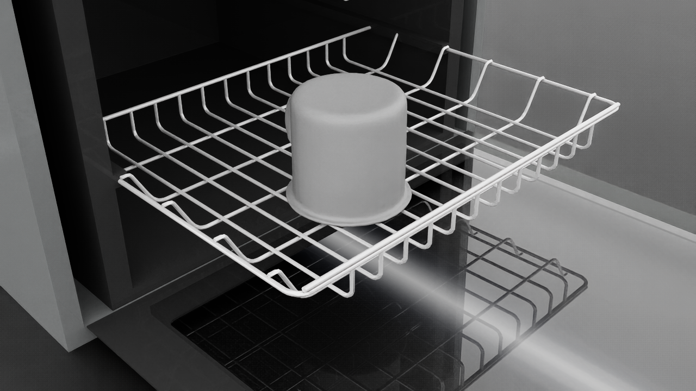
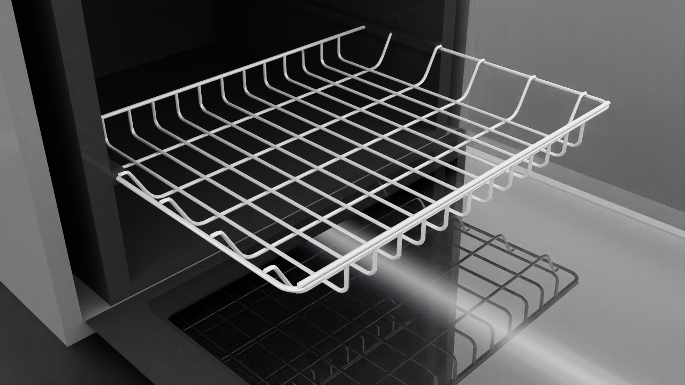

# v0 report — OMPL placement planning (dishwasher lower rack)

Task: UR5e + Robotiq 2F-85 with a YCB mug (plate stand-in; `029_plate` is not in the
Isaac 6.0 asset bucket) welded to the TCP; RRT-Connect plans a collision-free path to a
standing slot on the extended lower rack; the weld is released and the placement must
satisfy [success_criteria.md](success_criteria.md). Stack: Isaac Sim 6.0.1 + Isaac Lab
3.0 (execution/ground truth), OMPL 2.0.1 + python-fcl 0.7 + CoACD 1.0 (planning),
hand-rolled analytic UR5e IK validated against Pinocchio (see docs/environment.md).

## Headline numbers

- **Success rate: 23/31 (74 %)** over 6 slots x 5 seeds
- Plan time [s]: mean 1.41, median 0.81, p95 5.03, max 5.04 (budget 5.0 s)
- Path length [rad]: mean 7.17, median 7.26, p95 11.77, max 12.25
- Final placement error: lateral [mm] mean 7.7, median 8.1, p95 12.7, max 12.9; tilt [deg] mean 0.54, median 0.00, p95 3.76, max 3.80
- FCL collision world: 98 % agreement with Isaac contacts (0 non-conservative mismatches over 200 configs), ~0.2 ms/query — see media/D/parity_results.json

## Per-slot results

| slot | trials | successes | rate | note |
|---|---|---|---|---|
| 1 | 5 | 4 | 80 % |  |
| 2 | 6 | 6 | 100 % |  |
| 3 | 5 | 5 | 100 % |  |
| 4 | 5 | 4 | 80 % |  |
| 7 | 5 | 4 | 80 % |  |
| 9 | 5 | 0 | 0 % | empty goal set (deep interior / reach limit) |

## Failure breakdown

| stage | count |
|---|---|
| no-goal-config | 5 |
| planner-timeout | 2 |
| execution-collision | 1 |
| unstable-after-release | 0 |

Goal-config scarcity per slot (the rejection funnels) is recorded in
`assets/cache/slots/goal_sets.json`; deep-interior slots yield zero collision-free
goals because the arm cannot descend into the machine cavity — expected signal, not a
pipeline defect.

## Curated figures

## Media gallery (full evidence on disk, gitignored)

| trial | slot | seed | outcome | stage | plan [s] | video | final still |
|---|---|---|---|---|---|---|---|
| trial_01_00_0 | 1 | 0 | SUCCESS | — | 1.685 | media/F/trial_01_00_0.mp4 | media/F/trial_01_00_0_final.png |
| trial_01_01_0 | 1 | 1 | SUCCESS | — | 1.053 | media/F/trial_01_01_0.mp4 | media/F/trial_01_01_0_final.png |
| trial_01_02_0 | 1 | 2 | SUCCESS | — | 0.442 | media/F/trial_01_02_0.mp4 | media/F/trial_01_02_0_final.png |
| trial_01_03_0 | 1 | 3 | SUCCESS | — | 0.239 | media/F/trial_01_03_0.mp4 | media/F/trial_01_03_0_final.png |
| trial_01_04_0 | 1 | 4 | fail | execution-collision | 1.451 | media/F/trial_01_04_0.mp4 | media/F/trial_01_04_0_final.png |
| trial_02_00_0 | 2 | 0 | SUCCESS | — | 0.243 | media/F/trial_02_00_0.mp4 | media/F/trial_02_00_0_final.png |
| trial_02_00_1 | 2 | 0 | SUCCESS | — | 0.737 | media/F/trial_02_00_1.mp4 | media/F/trial_02_00_1_final.png |
| trial_02_01_0 | 2 | 1 | SUCCESS | — | 3.155 | media/F/trial_02_01_0.mp4 | media/F/trial_02_01_0_final.png |
| trial_02_02_0 | 2 | 2 | SUCCESS | — | 0.875 | media/F/trial_02_02_0.mp4 | media/F/trial_02_02_0_final.png |
| trial_02_03_0 | 2 | 3 | SUCCESS | — | 1.454 | media/F/trial_02_03_0.mp4 | media/F/trial_02_03_0_final.png |
| trial_02_04_0 | 2 | 4 | SUCCESS | — | 0.312 | media/F/trial_02_04_0.mp4 | media/F/trial_02_04_0_final.png |
| trial_03_00_0 | 3 | 0 | SUCCESS | — | 0.946 | media/F/trial_03_00_0.mp4 | media/F/trial_03_00_0_final.png |
| trial_03_01_0 | 3 | 1 | SUCCESS | — | 1.562 | media/F/trial_03_01_0.mp4 | media/F/trial_03_01_0_final.png |
| trial_03_02_0 | 3 | 2 | SUCCESS | — | 0.575 | media/F/trial_03_02_0.mp4 | media/F/trial_03_02_0_final.png |
| trial_03_03_0 | 3 | 3 | SUCCESS | — | 0.626 | media/F/trial_03_03_0.mp4 | media/F/trial_03_03_0_final.png |
| trial_03_04_0 | 3 | 4 | SUCCESS | — | 0.495 | media/F/trial_03_04_0.mp4 | media/F/trial_03_04_0_final.png |
| trial_04_00_0 | 4 | 0 | SUCCESS | — | 0.478 | media/F/trial_04_00_0.mp4 | media/F/trial_04_00_0_final.png |
| trial_04_01_0 | 4 | 1 | SUCCESS | — | 0.194 | media/F/trial_04_01_0.mp4 | media/F/trial_04_01_0_final.png |
| trial_04_02_0 | 4 | 2 | fail | planner-timeout | 5.036 | media/F/trial_04_02_0.mp4 | media/F/trial_04_02_0_final.png |
| trial_04_03_0 | 4 | 3 | SUCCESS | — | 2.24 | media/F/trial_04_03_0.mp4 | media/F/trial_04_03_0_final.png |
| trial_04_04_0 | 4 | 4 | SUCCESS | — | 0.706 | media/F/trial_04_04_0.mp4 | media/F/trial_04_04_0_final.png |
| trial_07_00_0 | 7 | 0 | SUCCESS | — | 0.455 | media/F/trial_07_00_0.mp4 | media/F/trial_07_00_0_final.png |
| trial_07_01_0 | 7 | 1 | SUCCESS | — | 3.619 | media/F/trial_07_01_0.mp4 | media/F/trial_07_01_0_final.png |
| trial_07_02_0 | 7 | 2 | SUCCESS | — | 2.938 | media/F/trial_07_02_0.mp4 | media/F/trial_07_02_0_final.png |
| trial_07_03_0 | 7 | 3 | fail | planner-timeout | 5.018 | media/F/trial_07_03_0.mp4 | media/F/trial_07_03_0_final.png |
| trial_07_04_0 | 7 | 4 | SUCCESS | — | 0.157 | media/F/trial_07_04_0.mp4 | media/F/trial_07_04_0_final.png |
| trial_09_00_0 | 9 | 0 | fail | no-goal-config | — | media/F/trial_09_00_0.mp4 | media/F/trial_09_00_0_final.png |
| trial_09_01_0 | 9 | 1 | fail | no-goal-config | — | media/F/trial_09_01_0.mp4 | media/F/trial_09_01_0_final.png |
| trial_09_02_0 | 9 | 2 | fail | no-goal-config | — | media/F/trial_09_02_0.mp4 | media/F/trial_09_02_0_final.png |
| trial_09_03_0 | 9 | 3 | fail | no-goal-config | — | media/F/trial_09_03_0.mp4 | media/F/trial_09_03_0_final.png |
| trial_09_04_0 | 9 | 4 | fail | no-goal-config | — | media/F/trial_09_04_0.mp4 | media/F/trial_09_04_0_final.png |
