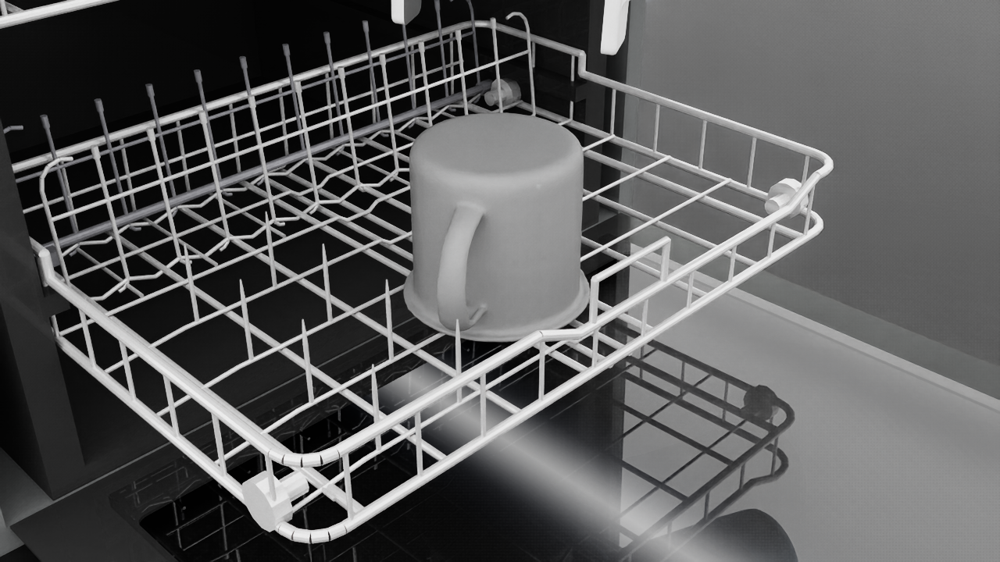
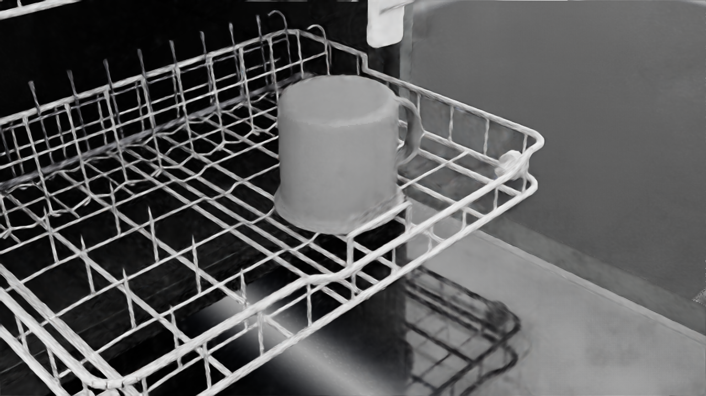
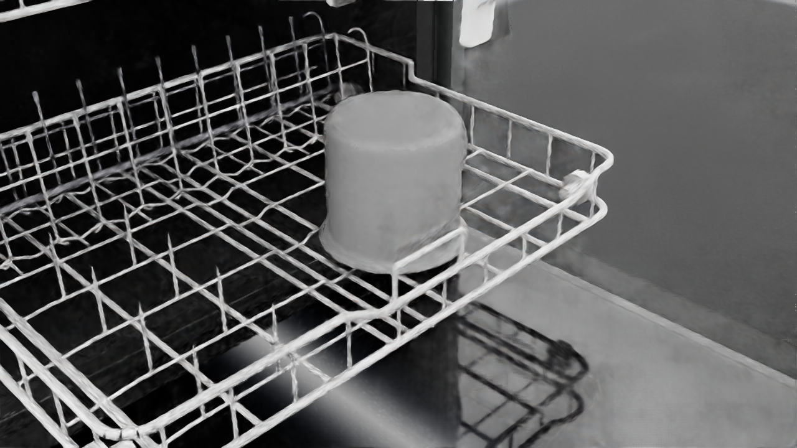

# v0 report — OMPL placement planning (dishwasher lower rack, two rack states)

Task: UR5e + Robotiq 2F-85 with a YCB mug (plate stand-in; `029_plate` is not in the
Isaac 6.0 asset bucket) welded to the TCP; RRT-Connect plans a collision-free path to a
standing slot on the lower rack; the weld is released and the placement must satisfy
[success_criteria.md](success_criteria.md). Both racks are procedurally generated
realistic wire racks (rack_gen v2, styled after the Whirlpool WDTA50SAKZ / Bosch 800 /
Frigidaire FDPC4314AS references: 3-gauge wires, 30 mm tine rows with candy-cane ends,
fold-down insert row, wheels, cup shelves). The derived scene raises the upper rack by
120 mm to restore a real machine's 250-300 mm inter-rack loading clearance (the ArtVIP
asset gives 154 mm to real-scale dishware). Validated in the two robot-facing rack
states: **both_out** (both racks fully extended) and **both_in** (fully retracted).
Stack: Isaac Sim 6.0.1 + Isaac Lab 3.0 (execution/ground truth), OMPL 2.0.1 +
python-fcl 0.7 + CoACD 1.0 (planning), analytic UR5e IK (see docs/environment.md).

## Headline numbers

- **Success rate: 24/24 (100 %)** over 12 scenario-slots x 2 seeds
- Plan time [s]: mean 2.67, median 1.47, p95 7.31, max 7.61 (budget 5.0 s)
- Path length [rad]: mean 6.81, median 6.96, p95 9.24, max 9.57
- Final placement error: lateral [mm] mean 9.0, median 9.5, p95 12.0, max 12.0; tilt [deg] mean 0.06, median 0.01, p95 0.79, max 1.03
- FCL collision world (both_out): **100.0 % agreement** with Isaac contacts over 200 configs, 0.83 ms/query
- FCL collision world (both_in): **100.0 % agreement** with Isaac contacts over 200 configs, 0.73 ms/query

## Scenario `both_in` — 12/12 successes

| slot | trials | successes | rate | note |
|---|---|---|---|---|
| 2 | 2 | 2 | 100 % |  |
| 3 | 2 | 2 | 100 % |  |
| 4 | 2 | 2 | 100 % |  |
| 7 | 2 | 2 | 100 % |  |
| 8 | 2 | 2 | 100 % |  |
| 9 | 2 | 2 | 100 % |  |

## Scenario `both_out` — 12/12 successes

| slot | trials | successes | rate | note |
|---|---|---|---|---|
| 2 | 2 | 2 | 100 % |  |
| 3 | 2 | 2 | 100 % |  |
| 4 | 2 | 2 | 100 % |  |
| 7 | 2 | 2 | 100 % |  |
| 8 | 2 | 2 | 100 % |  |
| 9 | 2 | 2 | 100 % |  |

## Failure breakdown

| stage | count |
|---|---|
| no-goal-config | 0 |
| rack-approach-plan | 0 |
| rack-slide-plan | 0 |
| rack-slide-fault | 0 |
| pick-plan | 0 |
| pick-grasp-fault | 0 |
| pick-weld-fault | 0 |
| grasp-fault | 0 |
| planner-timeout | 0 |
| execution-collision | 0 |
| release-fault | 0 |
| retract-collision | 0 |
| unstable-after-release | 0 |

Goal-config scarcity per slot (the rejection funnels) is recorded in
`assets/cache/slots/goal_sets.json`; deep-interior slots yield zero collision-free
goals because the arm cannot descend into the machine cavity — expected signal, not a
pipeline defect.

## Curated figures

## Media gallery (full evidence on disk, gitignored)

| trial | scenario | slot | seed | outcome | stage | plan [s] | video | final still |
|---|---|---|---|---|---|---|---|---|
| trial_02_00_0 | both_in | 2 | 0 | SUCCESS | — | 1.452 | media/F/both_in/trial_02_00_0.mp4 | media/F/both_in/trial_02_00_0_final.png |
| trial_02_01_0 | both_in | 2 | 1 | SUCCESS | — | 0.853 | media/F/both_in/trial_02_01_0.mp4 | media/F/both_in/trial_02_01_0_final.png |
| trial_03_00_0 | both_in | 3 | 0 | SUCCESS | — | 2.505 | media/F/both_in/trial_03_00_0.mp4 | media/F/both_in/trial_03_00_0_final.png |
| trial_03_01_0 | both_in | 3 | 1 | SUCCESS | — | 2.057 | media/F/both_in/trial_03_01_0.mp4 | media/F/both_in/trial_03_01_0_final.png |
| trial_04_00_0 | both_in | 4 | 0 | SUCCESS | — | 1.098 | media/F/both_in/trial_04_00_0.mp4 | media/F/both_in/trial_04_00_0_final.png |
| trial_04_01_0 | both_in | 4 | 1 | SUCCESS | — | 1.654 | media/F/both_in/trial_04_01_0.mp4 | media/F/both_in/trial_04_01_0_final.png |
| trial_07_00_0 | both_in | 7 | 0 | SUCCESS | — | 6.115 | media/F/both_in/trial_07_00_0.mp4 | media/F/both_in/trial_07_00_0_final.png |
| trial_07_01_0 | both_in | 7 | 1 | SUCCESS | — | 1.275 | media/F/both_in/trial_07_01_0.mp4 | media/F/both_in/trial_07_01_0_final.png |
| trial_08_00_0 | both_in | 8 | 0 | SUCCESS | — | 1.382 | media/F/both_in/trial_08_00_0.mp4 | media/F/both_in/trial_08_00_0_final.png |
| trial_08_01_0 | both_in | 8 | 1 | SUCCESS | — | 0.815 | media/F/both_in/trial_08_01_0.mp4 | media/F/both_in/trial_08_01_0_final.png |
| trial_09_00_0 | both_in | 9 | 0 | SUCCESS | — | 6.39 | media/F/both_in/trial_09_00_0.mp4 | media/F/both_in/trial_09_00_0_final.png |
| trial_09_01_0 | both_in | 9 | 1 | SUCCESS | — | 7.611 | media/F/both_in/trial_09_01_0.mp4 | media/F/both_in/trial_09_01_0_final.png |
| trial_02_00_0 | both_out | 2 | 0 | SUCCESS | — | 1.356 | media/F/trial_02_00_0.mp4 | media/F/trial_02_00_0_final.png |
| trial_02_01_0 | both_out | 2 | 1 | SUCCESS | — | 0.857 | media/F/trial_02_01_0.mp4 | media/F/trial_02_01_0_final.png |
| trial_03_00_0 | both_out | 3 | 0 | SUCCESS | — | 2.709 | media/F/trial_03_00_0.mp4 | media/F/trial_03_00_0_final.png |
| trial_03_01_0 | both_out | 3 | 1 | SUCCESS | — | 2.049 | media/F/trial_03_01_0.mp4 | media/F/trial_03_01_0_final.png |
| trial_04_00_0 | both_out | 4 | 0 | SUCCESS | — | 1.138 | media/F/trial_04_00_0.mp4 | media/F/trial_04_00_0_final.png |
| trial_04_01_0 | both_out | 4 | 1 | SUCCESS | — | 1.486 | media/F/trial_04_01_0.mp4 | media/F/trial_04_01_0_final.png |
| trial_07_00_0 | both_out | 7 | 0 | SUCCESS | — | 6.087 | media/F/trial_07_00_0.mp4 | media/F/trial_07_00_0_final.png |
| trial_07_01_0 | both_out | 7 | 1 | SUCCESS | — | 1.346 | media/F/trial_07_01_0.mp4 | media/F/trial_07_01_0_final.png |
| trial_08_00_0 | both_out | 8 | 0 | SUCCESS | — | 1.354 | media/F/trial_08_00_0.mp4 | media/F/trial_08_00_0_final.png |
| trial_08_01_0 | both_out | 8 | 1 | SUCCESS | — | 0.826 | media/F/trial_08_01_0.mp4 | media/F/trial_08_01_0_final.png |
| trial_09_00_0 | both_out | 9 | 0 | SUCCESS | — | 6.291 | media/F/trial_09_00_0.mp4 | media/F/trial_09_00_0_final.png |
| trial_09_01_0 | both_out | 9 | 1 | SUCCESS | — | 5.447 | media/F/trial_09_01_0.mp4 | media/F/trial_09_01_0_final.png |
